# Create EFI & Config

## Using OpenCore Auxiliary Tools (OCAuxiliaryTools)

- This is an excellent configuration and update utility. *OCAuxiliaryTools* will be used to create the complete OpenCore EFI folder including the Config.plist. (You may use this alongside a plist editor such as [PlistEDPlus](https://github.com/ic005k/PlistEDPlus)).

- Download & install [OpenCore Auxiliary Tools - OCAT](https://github.com/ic005k/QtOpenCoreConfig) and launch the *OCAuxiliaryTools* application.

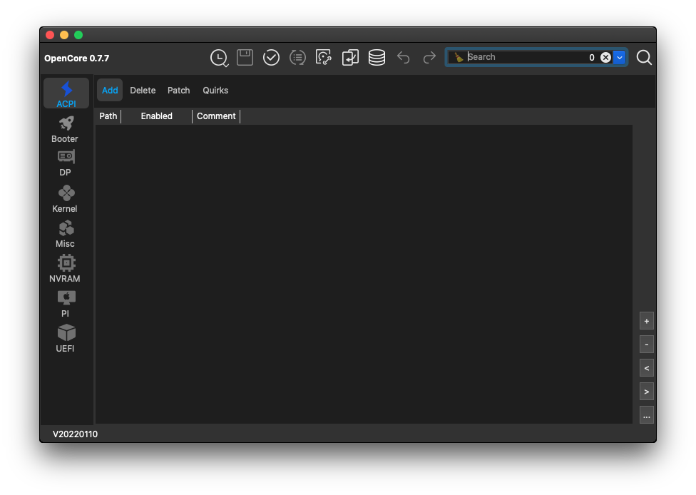

- Select *Menu -> Edit -> Database* or click the *Database* button

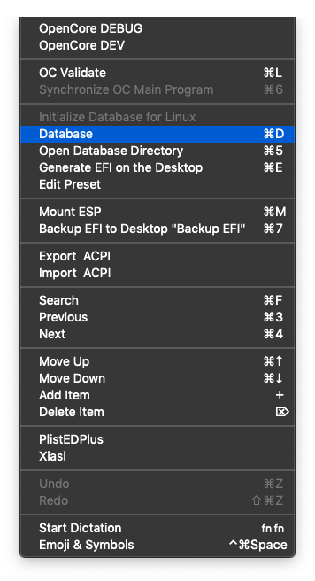

- Check which [Platform Info](https://dortania.github.io/OpenCore-Install-Guide/config.plist/comet-lake.html#platforminfo) is relevant for your hardware. For this example we will use `iMac20,1` 

- Select the relevant configuration and click the *Generate EFI* button

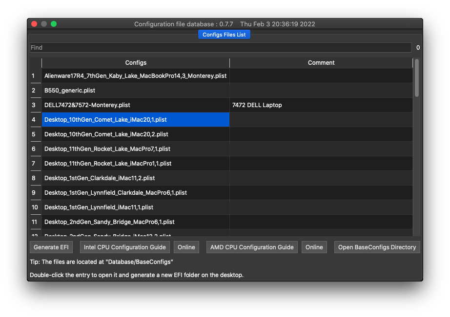

- This will generate the EFI folder with the most recent official release version of OpenCore on your desktop. The `Config.plist` will open in *OCAuxiliaryTools* for editing.

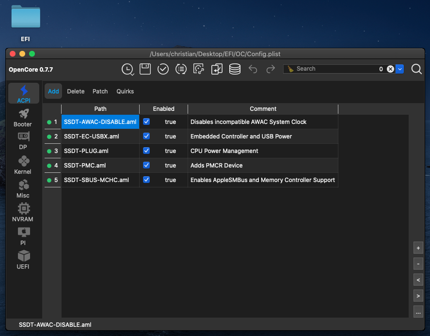

### ACPI

- In [ACPI - Add](https://dortania.github.io/OpenCore-Install-Guide/config.plist/comet-lake.html#acpi) uncheck what is not needed (as shown below)

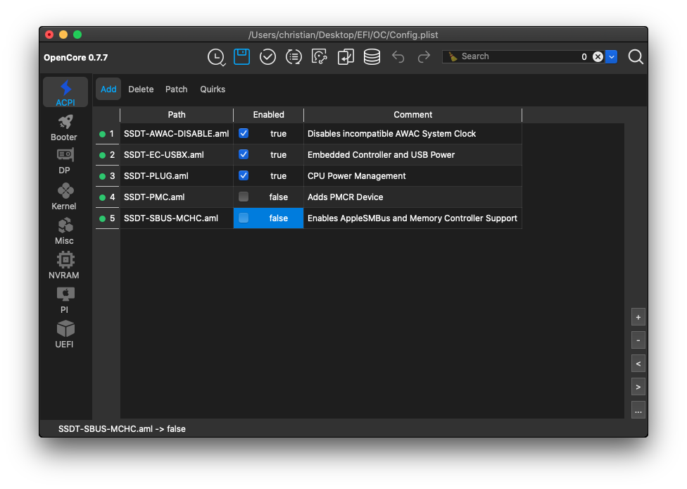

- For example we may not need  [SSDT-PMC](https://dortania.github.io/Getting-Started-With-ACPI/Universal/nvram)  in Comet Lake any more, as the NVRAM works without it.

- Check the relevant section of the [Desktop Comet Lake | OpenCore Install Guide](https://dortania.github.io/OpenCore-Install-Guide/config.plist/comet-lake.html#acpi) for more details.

- Add any additional SSDTs, if needed by clicking on the **[+]** button for downloaded SSDTs or by clicking on the **[…]** button for the most common prebuilt SSDTs available within *OCAuxiliaryTools*

- In [ACPI - Quirks](https://dortania.github.io/OpenCore-Install-Guide/config.plist/comet-lake.html#acpi), uncheck *ResetLogoStatus*. (It is enabled by default in sample.plist. This Quirk didn't exist at the time the OpenCore Install Guide was written, so it's unknown if it's a requirement. Most likely it's not. @5T33Z0)

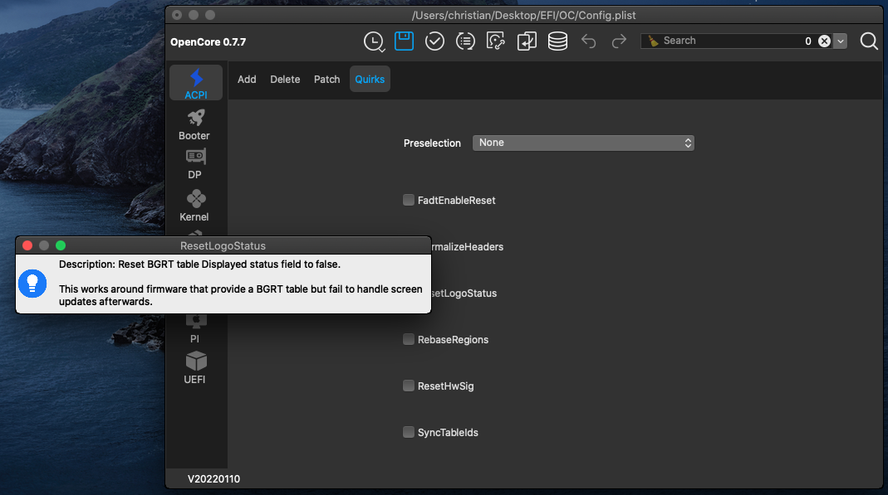

  **You can hover with your mouse over each option to see the explanation from the official OpenCore reference manual.** This is a really helpful feature of *OCAuxiliaryTools*, as it enables you to quickly understand options which are only clearly explained in the very detailed [OpenCore - Configuration](https://dortania.github.io/docs/latest/Configuration.html) document:

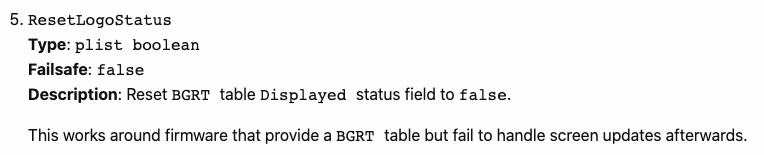

### Booter

- No changes in [Booter](https://dortania.github.io/OpenCore-Install-Guide/config.plist/comet-lake.html#booter)

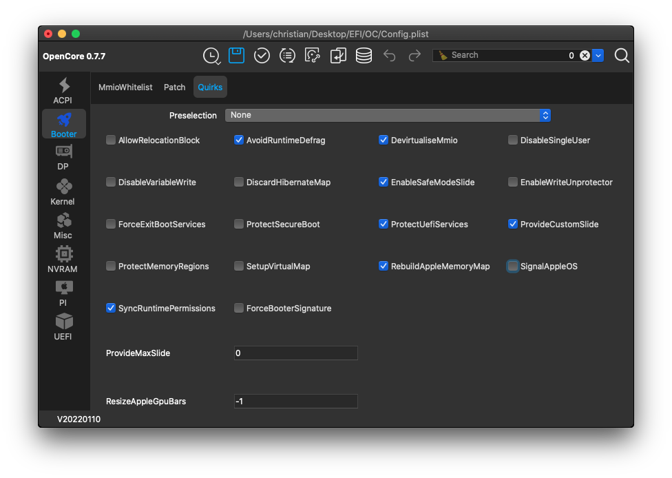

### Device Properties

- In [Device Properties](https://dortania.github.io/OpenCore-Install-Guide/config.plist/comet-lake.html#deviceproperties) enable the iGPU for computing tasks only (not intended to drive a display), as you will be using a compatible dedicated AMD GPU.
- Change  `AAPL,ig-platform-id` to `0300913E`

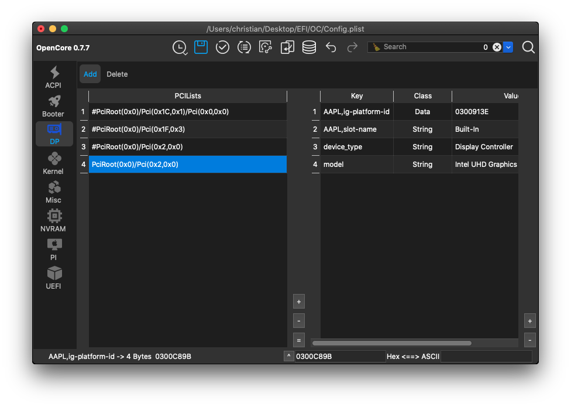

- Note, that keys which start with a **#** are commented out and will not be used by OpenCore

### Kernel

- In the [Kernel](https://dortania.github.io/OpenCore-Install-Guide/config.plist/comet-lake.html#kernel) section add `IntelMausi.kext`, the Intel onboard Ethernet driver for macOS.

- Click on the **[...]** button to open the most common kexts available within *OCAuxiliaryTools*. Just drag-and-drop `IntelMausi.kext` into the app window. It will automatically be added to the Config.plist and enabled.

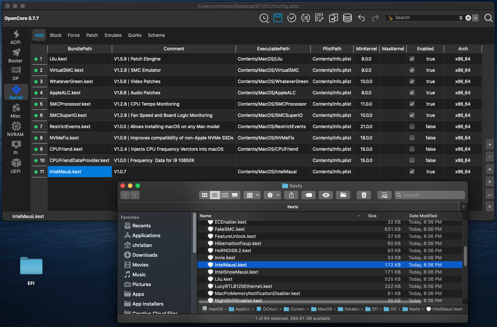

- Add any additional kexts, if needed by clicking on the **[+]** button for kexts downloaded from elsewhere.

- No changes in the [Kernel - Quirks](https://dortania.github.io/OpenCore-Install-Guide/config.plist/comet-lake.html#quirks-3) section

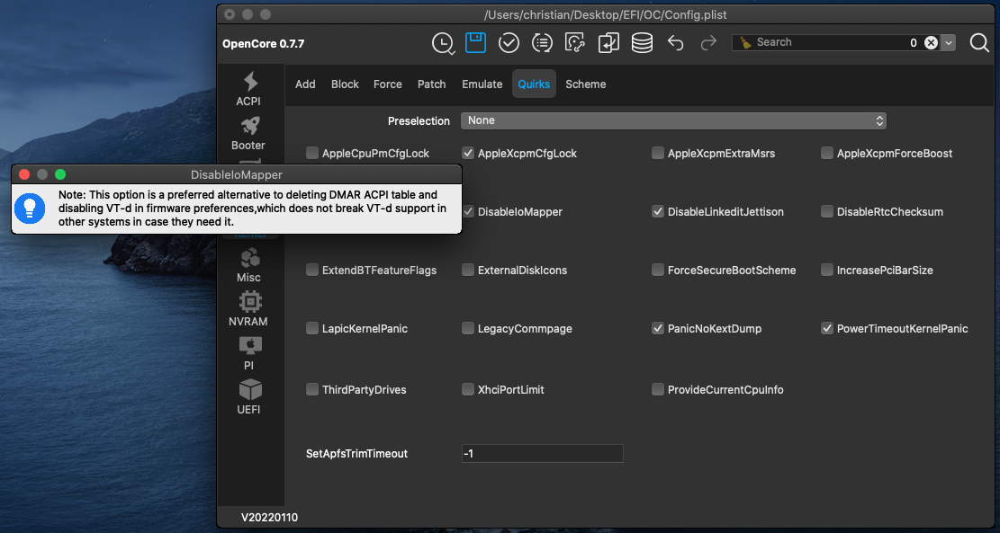

- Again just hover with the mouse over each option to read the explanation from the OpenCore documentation.

### Misc

- In the section [Misc - Boot ](https://dortania.github.io/OpenCore-Install-Guide/config.plist/comet-lake.html#misc) you may choose PickerVariant *GoldenGate* for the OpenCore booter GUI

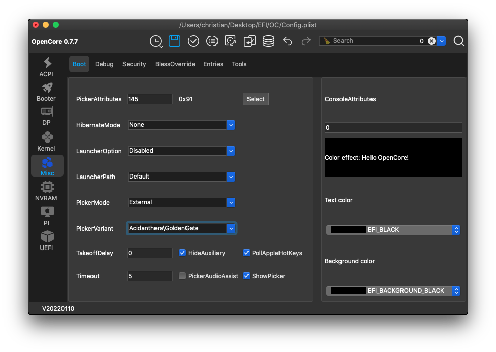

- In the [Misc - Debug](https://dortania.github.io/OpenCore-Install-Guide/config.plist/comet-lake.html#debug) section: *DisplayLevel* click the *Select* button and enable *Debug__Warn* and *Debug__Error*

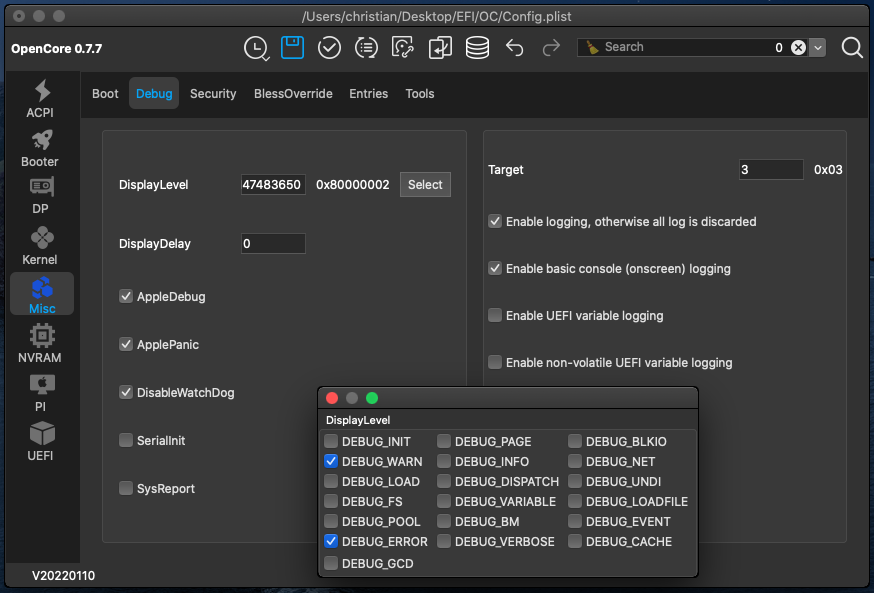

- By default the EFI created by *OCAuxiliaryTools* uses the most recent *release* version of OpenCore. If you want to show additional debug information change `Target` to `67`  and switch to the *debug* version of OpenCore, which will be explained at the end of this guide.

- In the [Misc - Security](https://dortania.github.io/OpenCore-Install-Guide/config.plist/comet-lake.html#security) section change *SecureBootModel* to *Default* if installing macOS Big Sur or newer.

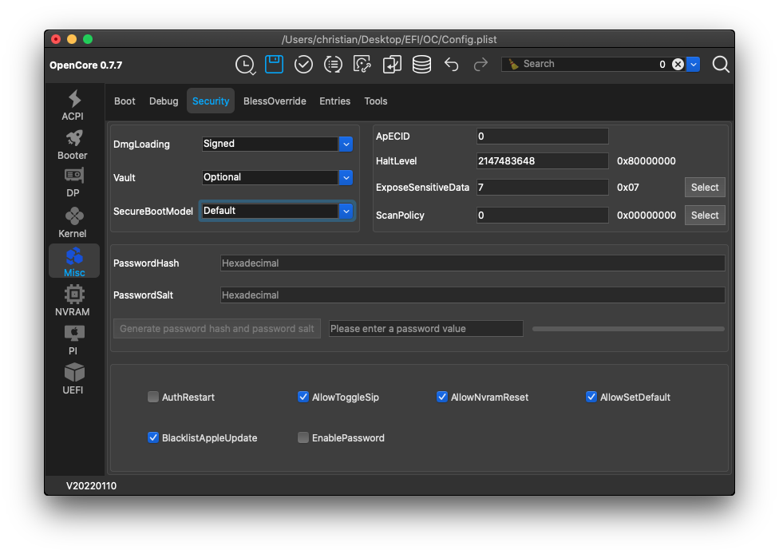

- In [Misc - Tools](https://dortania.github.io/OpenCore-Install-Guide/config.plist/comet-lake.html#tools), click the **[…]** button and add `OpenShell.efi` by dragging it into the list

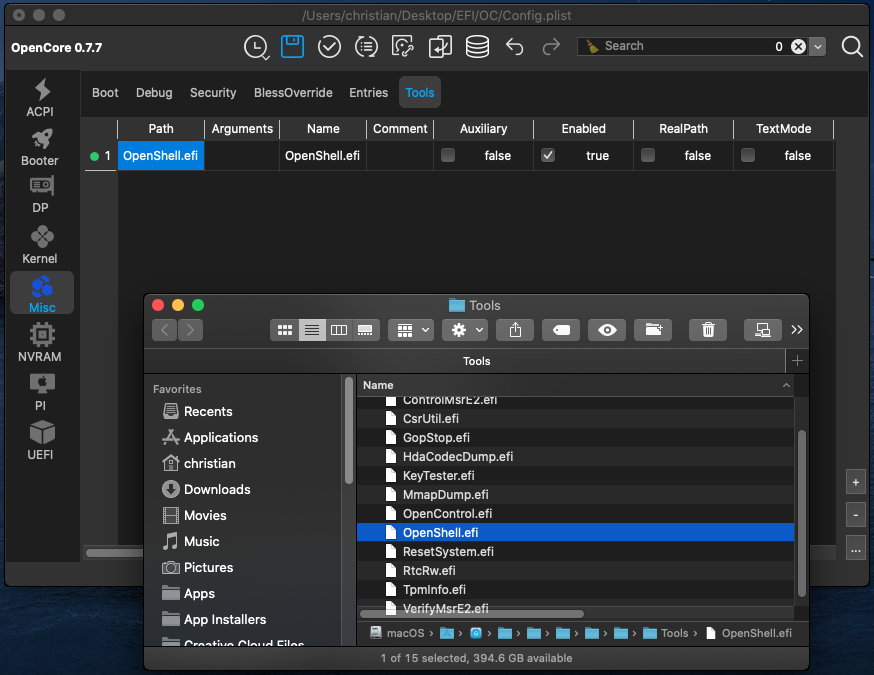

### NVRAM

- In [NVRAM - Add](https://dortania.github.io/OpenCore-Install-Guide/config.plist/comet-lake.html#add-4) change `csr-active-config` to `00000000` to enable SIP.

- Add the following string in `boot-args` for debugging and audio: `-v debug=0x100 keepsyms=1 alcid=1`

- Change `prev-lang:kbd`  to use a `String` and input `en-US:0` (or your language code) instead of using the HEX value.

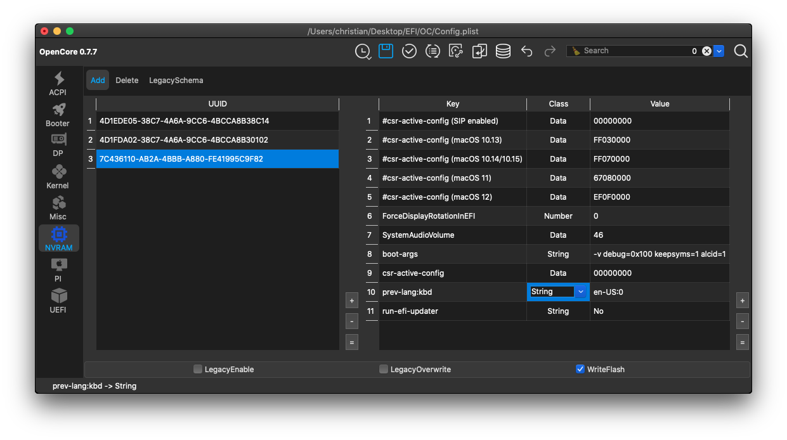

### Platform Info

- In the [Platform Info - Generic](https://dortania.github.io/OpenCore-Install-Guide/config.plist/comet-lake.html#platforminfo) section, use the built-in Generator of *OCAuxiliaryTools* for setting up the SMBIOS info (instead of using the *GenSMBIOS* terminal application).

- Click *Generate* (near the *SystemProductName* field)

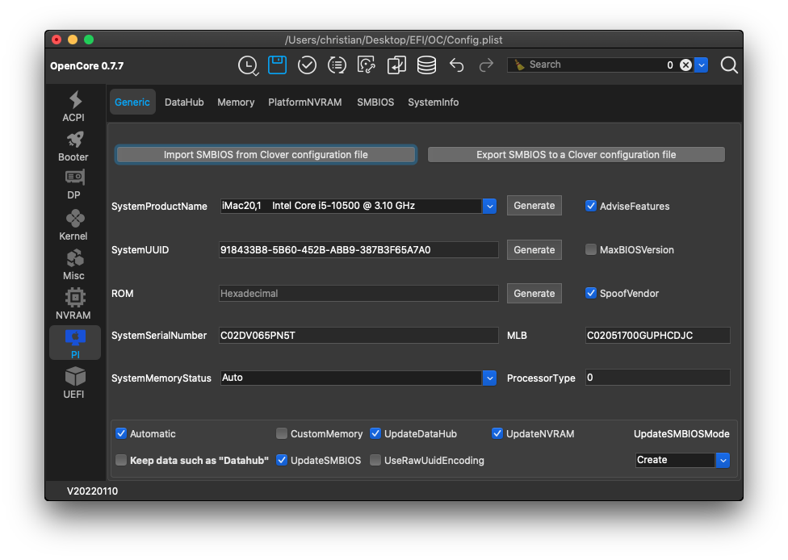

- Also check the serial on the  [Apple Support](https://checkcoverage.apple.com/us/en/) webpage.

- You should see *“… we’re unable to check coverage for this serial number”* or something similar in your language. This is the response you want, because your Hackintosh should not reuse someone else’s existing serial from a real Mac.

- Note: the *SystemInfo* tab of *OCAuxiliaryTools* displays the *macserial* info of the currently used system, not of the new serial generated for the EFI on the Desktop.

### UEFI

- No changes needed in the [UEFI](https://dortania.github.io/OpenCore-Install-Guide/config.plist/comet-lake.html#uefi) section

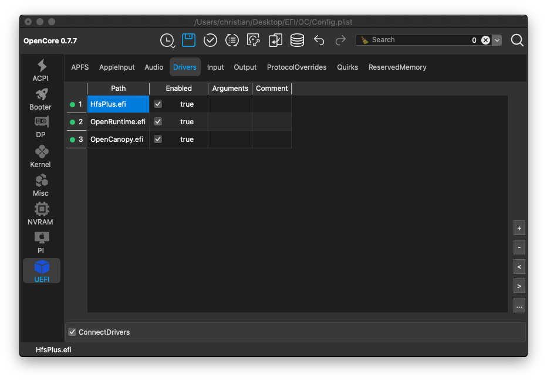

- You can add additional drivers using the **[+]** or **[…]** button.
- The OpenCanopy boot GUI will work out-of-the-box as *OCAuxiliaryTools* activates it by default.
- If you want to enable the *Boot Chime*, you can configure it in the *UEFI-Audio* section during post-install. See [Setting up Boot-chime with AudioDxe](https://dortania.github.io/OpenCore-Post-Install/cosmetic/gui.html#setting-up-boot-chime-with-audiodxe).

### Notes

- If your motherboard uses the Intel’s I225-V 2.5GBe ethernet controller, additional settings are required in the relevant sections. Just refer to the [OpenCore Install Guide](https://dortania.github.io/OpenCore-Install-Guide/) and use the applicable presets in *OCAuxiliaryTools*.
- Remember to **save your Config.plist** by clicking the *Save* button or with Menu -> Edit -> Save.

