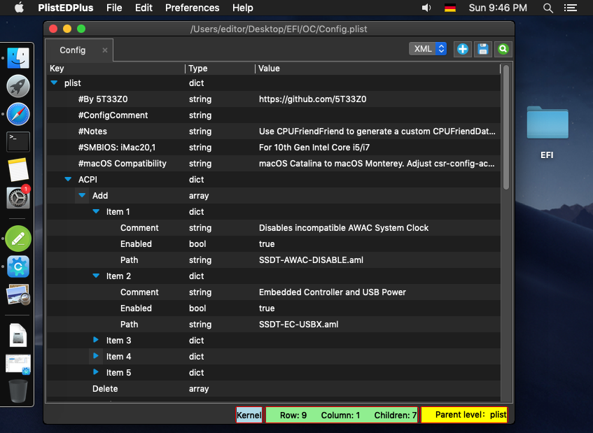
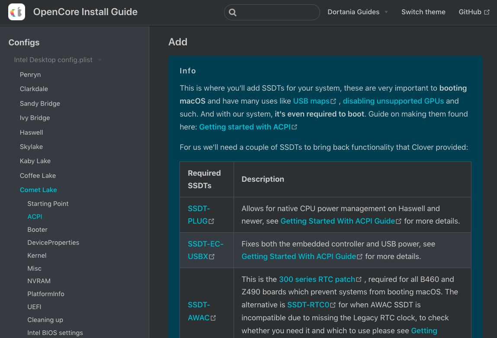
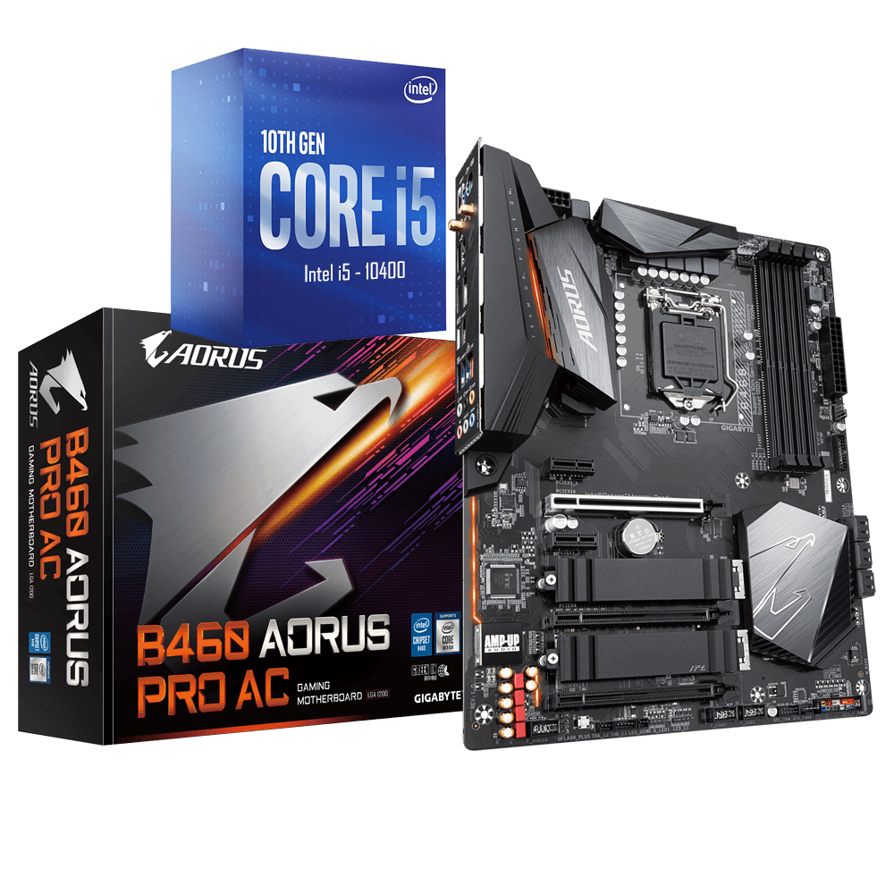

# Intro & Hardware

## OpenCore Visual Beginners Guide 2022

This is intended to be a beginner friendly OpenCore guide which uses mostly GUI Tools like _OCAuxiliaryTools_ and _OCLP_ to create a vanilla hackintosh install. This should make starting out with OpenCore more accessible. Everything done by these tools is transparent to the user and allows complete customization. All downloads are from official sources, usually from the Github repos of the original developers. This guide is based on the [OpenCore Install Guide](https://dortania.github.io/OpenCore-Install-Guide/) by Dortania only making minimal changes when using compatible GUI tools. You do need to read, study and understand the basics of the [OpenCore Install Guide](https://dortania.github.io/OpenCore-Install-Guide/) first before embarking on any hackintosh project.

### Who this guide is for ...

* those who are fairly new to setting up a hackintosh.
* those who are new to OpenCore, and would like a quick-start to get into OpenCore.
* those who are experienced with OpenCore, but would like to try a more efficient workflow, which may also help to get friends or family to learn how to hackintosh their computer.

### Desktop Hardware Recommendations

* Those who have not set up a hackintosh previously, should gain experience on straightforward _desktop_ hardware. _(Laptops are much harder for beginners!)_
* CPU: Intel Core i3 to i9, preferably Haswell (4th Gen) to Comet Lake (10th Gen). _For experienced users Alder Lake (12th Gen) will work as well; see_ [_Using Alder Lake_](https://chriswayg.gitbook.io/opencore-visual-beginners-guide/using-alder-lake)_._
* MB: Preferably a Gigabyte or Asus motherboard.
* GPU: Intel iGPU or preferably a dedicated AMD GPU (Radeon RX 460 up to RX 6900 XT). Sapphire, Gigabyte or Asus are recommended.
* RAM: 8 GB or more.
* STORAGE: A SATA SSD or NVMe main drive with at least 120 GB _(preferably not a Samsung NVMe)_.
* WIFI: easiest is a Fenvi FV-T919 which has Bluetooth included.

Detailed Hackintosh hardware information about all compatible configurations can be found here: [Hardware Limitations](https://dortania.github.io/OpenCore-Install-Guide/macos-limits.html#hardware-limitations), [GPU Buyers Guide](https://dortania.github.io/GPU-Buyers-Guide/), [Wireless Buyers Guide](https://dortania.github.io/Wireless-Buyers-Guide/), [Anti-Hackintosh Buyers Guide](https://dortania.github.io/Anti-Hackintosh-Buyers-Guide/) and in the FAQ [Hardware Compatibility](https://www.reddit.com/r/hackintosh/wiki/faq#wiki\_ok.21\_i\_fulfill\_some\_points.2C\_what\_now.3F).

### Prerequisites

* An existing computer or VM running a recent version of macOS (High Sierra or newer)

* Familiarize yourself with the [OpenCore Install Guide](https://dortania.github.io/OpenCore-Install-Guide/) and use it to follow along in the relevant sections for more detailed configuration options.

### Example Hardware

For this guide I have selected recent compatible hardware for a beginner friendly example of installing Big Sur or Monterey. I have used this workflow with comparable hardware for multiple systems already. My links to the _OpenCore Install Guide_ point to the relevant 10th Gen _Comet Lake_ sections.

The _example hardware_ is similar to the internals of a [mid-2020 iMac](https://everymac.com/systems/apple/imac/specs/imac-core-i7-3.8-8-core-27-inch-retina-5k-2020-20-2-specs.html):

* CPU: 10th Gen Comet Lake i5-10400 _(or any i3-10100 to i7-10700K)_
* MB: Gigabyte B460 _(or Z490, H470, H410)_
* GPU: Sapphire RX 560 _(or other AMD Polaris)_

 _Except where otherwise noted, content on this site is licensed under the_ [_Creative Commons — Attribution-NonCommercial 4.0 International — CC BY-NC 4.0_](https://creativecommons.org/licenses/by-nc/4.0/) _license. Attribution by link to_ [_chriswayg · GitHub_](https://github.com/chriswayg)_._
