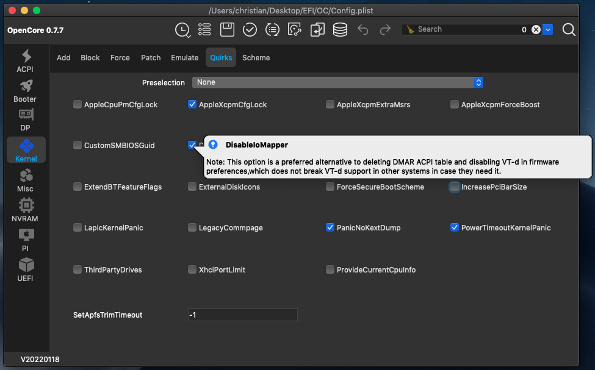

# Intro & Hardware

## Opencore Visual Beginners Guide 2022

This is intended to be a beginner friendly OpenCore guide which uses mostly GUI Tools to create a vanilla hackintosh install. This should make starting out with OpenCore more accessible. Everything done by these tools is transparent to the user and allows complete customisation. All downloads are from official sources, usually from the Github repos of the original developers. This guide is based on the [Dortania's OpenCore Install Guide](https://dortania.github.io/OpenCore-Install-Guide/), making minimal changes when using compatible GUI tools.

### Who this guide is for

* those who are fairly new to hackintoshing
* those who are new to OpenCore, and would like a quickstart to get into OpenCore
* those who are experienced with OpenCore, but would like to try a new beginner friendly workflow which might help to get friends or family to learn how to hackintosh

### Desktop Hardware Recommendations

* CPU: Intel Core i3 to i9, Haswell (4th-gen) to Comet Lake (10th-gen)
* MB: Preferably a Gigabyte or Asus motherboard
* GPU: Intel iGPU or a dedicated AMD GPU (Radeon RX 460 to RX 6900 XT): preferably Sapphire, Gigabyte or Asus
* 8 GB or more RAM
* SATA or NVMe SSD main drive with at least 120 GB

### Prerequsites

* An existing computer or VM running a recent version of macOS (High Sierra or newer)
* Familiarize yourself with the [OpenCore Install Guide](https://dortania.github.io/OpenCore-Install-Guide/) and use it to follow along in the relevant sections for more detailed configuration options.

### Example Hardware

For this guide I have selected recent compatible hardware for a beginner friendly example of installing Big Sur (or Monterey). I have used this workflow with comparable hardware for multiple systems already. My links to the _OpenCore Install Guide_ point to the relevant 10th-gen _Comet Lake_ sections. The hardware is similar to a [mid-2020 iMac](https://everymac.com/systems/apple/imac/specs/imac-core-i7-3.8-8-core-27-inch-retina-5k-2020-20-2-specs.html):

* CPU: 10th-gen Comet Lake i3-10100 to i7-10700K
* MB: Gigabyte or Asus with B460 (or Z490, H470, H410)
* GPU: A dedicated AMD GPU, RX 560 and above as a minimum
