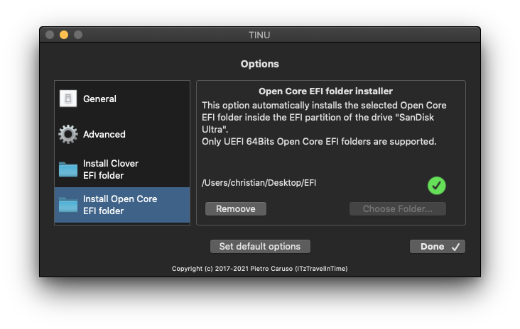

# Opencore Visual Beginners Guide

## Why this guide

This is intended to be a beginner friendly OpenCore guide which uses mostly GUI Tools to create a vanilla hackintosh install. This should make starting out with OpenCore more accessible. Everything done by these tools is transparent to the user and allows complete customisation. All downloads are from official sources, usually from the Github repos of the original developers. This guide is based on the [Dortania's OpenCore Install Guide](https://dortania.github.io/OpenCore-Install-Guide/), making minimal changes when using compatible GUI tools.

## Who this guide is for

* those who are fairly new to hackintoshing
* those who are new to OpenCore, and would like a quickstart to get into OpenCore
* those who are experienced with OpenCore, but would like to try a new beginner friendly workflow which might help to get friends or family to learn how to hackintosh

## Desktop Hardware Recommendations

* CPU: Intel Core i3 to i9, Haswell (4th-gen) to Comet Lake (10th-gen)
* MB: Preferably a Gigabyte or Asus motherboard
* GPU: Intel iGPU or a dedicated AMD GPU (Radeon RX 460 to RX 6900 XT): preferably Sapphire, Gigabyte or Asus
* 8 GB or more RAM
* SATA or NVMe SSD main drive with at least 120 GB

## Prerequsites

* An existing computer or VM running a recent version of macOS (High Sierra or newer)
* Familiarize yourself with the [OpenCore Install Guide](https://dortania.github.io/OpenCore-Install-Guide/) and use it to follow along in the relevant sections for more detailed configuration options.

## Example Hardware

For this guide I have selected recent compatible hardware for a beginner friendly example of installing Big Sur (or Monterey). I have used this workflow with comparable hardware for multiple systems already. My links to the *OpenCore Install Guide*  point to the relevant 10th-gen *Comet Lake* sections. The hardware is similar to a [mid-2020 iMac](https://everymac.com/systems/apple/imac/specs/imac-core-i7-3.8-8-core-27-inch-retina-5k-2020-20-2-specs.html):

- CPU: 10th-gen Comet Lake i3-10100 to i7-10700K

- MB: Gigabyte or Asus with B460 (or Z490, H470, H410)

- GPU: A dedicated AMD GPU, RX 560 and above as a minimum

## 1. Using OpenCore Auxiliary Tools (OCAuxiliaryTools)

- This is an excellent configuration and update utility. *OCAuxiliaryTools* will be used to create the complete OpenCore EFI folder including the Config.plist. (You may use this alongside a plist editor such as [PlistEDPlus](https://github.com/ic005k/PlistEDPlus)).

- Download & install [OpenCore Auxiliary Tools - OCAT](https://github.com/ic005k/QtOpenCoreConfig) and launch the *OCAuxiliaryTools* application.


- Select *Menu -> Edit -> Database* or click the *Database* button


- Check which [Platform Info](https://dortania.github.io/OpenCore-Install-Guide/config.plist/comet-lake.html#platforminfo) is relevant for your hardware. For this example we will use `iMac20,1` 

- Select the relevant configuration and click the *Generate EFI* button


- This will generate the EFI folder with the most recent official release version of OpenCore on your desktop. The `Config.plist` will open in *OCAuxiliaryTools* for editing.


### ACPI

- In [ACPI - Add](https://dortania.github.io/OpenCore-Install-Guide/config.plist/comet-lake.html#acpi) uncheck what is not needed (as shown below)


- For example we do not need  [SSDT-PMC](https://dortania.github.io/Getting-Started-With-ACPI/Universal/nvram)  in Comet Lake any more, as the NVRAM works without it.

- Check the relevant section of the [Desktop Comet Lake | OpenCore Install Guide](https://dortania.github.io/OpenCore-Install-Guide/config.plist/comet-lake.html#acpi) for more details.

- Add any additional SSDTs, if needed by clicking on the **[+]** button for downloaded SSDTs or by clicking on the **[…]** button for the most common prebuilt SSDTs available within *OCAuxiliaryTools*

- In [ACPI - Quirks](https://dortania.github.io/OpenCore-Install-Guide/config.plist/comet-lake.html#acpi), uncheck *ResetLogoStatus*


  
  **You can hover with your mouse over each option to see the explanation from the official OpenCore reference manual.** This is a really helpful feature of *OCAuxiliaryTools*, as it enables you to quickly understand options which are only clearly explained in the very detailed [OpenCore - Configuration](https://dortania.github.io/docs/latest/Configuration.html) document:
  


### Booter

- No changes in [Booter](https://dortania.github.io/OpenCore-Install-Guide/config.plist/comet-lake.html#booter)
  


### Device Properties

- In [Device Properties](https://dortania.github.io/OpenCore-Install-Guide/config.plist/comet-lake.html#deviceproperties) enable the iGPU for computing tasks only (not intended to drive a display), as you will be using a compatible dedicated AMD GPU.
- Change  `AAPL,ig-platform-id` to `0300913E`


  
  - Note, that keys which start with a **#** are commented out and will not be used by OpenCore

### Kernel

- In the [Kernel](https://dortania.github.io/OpenCore-Install-Guide/config.plist/comet-lake.html#kernel) section add `IntelMausi.kext`, the Intel onboard Ethernet driver for macOS.

- Click on the **[...]** button to open the most common kexts available within *OCAuxiliaryTools*. Just drag-and-drop `IntelMausi.kext` into the app window. It will automatically be added to the Config.plist and enabled.
  

  
  - Add any additional kexts, if needed by clicking on the **[+]** button for kexts downloaded from elsewhere.

- No changes in the [Kernel - Quirks](https://dortania.github.io/OpenCore-Install-Guide/config.plist/comet-lake.html#quirks-3) section
  

  
  - Again just hover with the mouse over each option to read the explanation from the OpenCore documentation.

### Misc

- In the section [Misc - Boot ](https://dortania.github.io/OpenCore-Install-Guide/config.plist/comet-lake.html#misc) you may choose PickerVariant *GoldenGate* for the OpenCore booter GUI


- In the [Misc - Debug](https://dortania.github.io/OpenCore-Install-Guide/config.plist/comet-lake.html#debug) section: *DisplayLevel* click the *Select* button and enable *Debug__Warn* and *Debug__Error*
  

  
  - You could change `Target` to `67`  to show additional debug information, but this requires that you utilize the debug version of OpenCore, which is not used by default in the EFI created by *OCAuxiliaryTools*. If you do require more extensive debugging, manually replace the following files Inside your EFI with the  [debug versions](https://github.com/acidanthera/OpenCorePkg/releases) :
    
    ```
    EFI/BOOT/BOOTx64.efi
    EFI/OC/Drivers/OpenRuntime.efi
    EFI/OC/OpenCore.efi
    ```

- In the [Misc - Security](https://dortania.github.io/OpenCore-Install-Guide/config.plist/comet-lake.html#security) section change *SecureBootModel* to *Default* if installing macOS Big Sur or newer.
  


- In [Misc - Tools](https://dortania.github.io/OpenCore-Install-Guide/config.plist/comet-lake.html#tools), click the **[…]** button and add `OpenShell.efi` by dragging it into the list
  


### NVRAM

- In [NVRAM - Add](https://dortania.github.io/OpenCore-Install-Guide/config.plist/comet-lake.html#add-4) change `csr-active-config` to `00000000` to enable SIP.

- Add the following string in `boot-args` for debugging and audio: `-v debug=0x100 keepsyms=1 alcid=1`

- Change `prev-lang:kbd`  to use a `String` and input `en-US:0` (or your language code) instead of using the HEX value.
  


### Platform Info

- In the [Platform Info - Generic](https://dortania.github.io/OpenCore-Install-Guide/config.plist/comet-lake.html#platforminfo) section, use the built-in Generator of *OCAuxiliaryTools* for setting up the SMBIOS info (instead of using the *GenSMBIOS* terminal application).

- Click *Generate* (near the *SystemProductName* field)
  

  
- Also check the serial on the  [Apple Support](https://checkcoverage.apple.com/us/en/) webpage.

- You should see *“… we’re unable to check coverage for this serial number”* or something similar in your language. This is the response you want, because your Hackintosh should not reuse someone else’s existing serial from a real Mac.

- Note: the *SystemInfo* tab of *OCAuxiliaryTools* displays the *macserial* info of the currently used system, not of the new serial generated for the EFI on the Desktop.

### UEFI

- No changes needed in the [UEFI](https://dortania.github.io/OpenCore-Install-Guide/config.plist/comet-lake.html#uefi) section
  

  
  - You can add additional drivers using the **[+]** or **[…]** button.
  - The OpenCanopy boot GUI will work out-of-the-box as *OCAuxiliaryTools* activates it by default.
  - If you want to enable the *Boot Chime*, you can configure it in the *UEFI-Audio* section during post-install. See [Setting up Boot-chime with AudioDxe](https://dortania.github.io/OpenCore-Post-Install/cosmetic/gui.html#setting-up-boot-chime-with-audiodxe).

### Notes

- If your motherboard uses the Intel’s I225-V 2.5GBe ethernet controller, additional settings are required in the relevant sections. Just refer to the [OpenCore Install Guide](https://dortania.github.io/OpenCore-Install-Guide/) and use relevant presets in *OCAuxiliaryTools*.
- Remember to **save your Config.plist** by clicking the *Save* button or with Menu -> Edit -> Save.

### Useful Features of OCAuxiliaryTools

- **Backup your EFI:** Menu -> Edit -> Backup EFI to Desktop 

- **Validate your Config.plist:** Menu -> Edit -> OC Validate
  


- **Mount your EFI partition:** Menu -> Edit -> Mount ESP Partition
  


- **Upgrade OpenCore and Kexts:** Menu -> Edit -> Sync OC Main Program

- Detailed instructions here: [Updating OpenCore and Kexts with OCAT](https://github.com/5T33Z0/OC-Little-Translated/blob/main/D_Updating_OpenCore/README.md)


## 2. Create a bootable installer for macOS with TINU

TINU is a very useful opensource GUI for the `createinstallmedia` command, together with some useful tools such as an EFI mounter, the macOS Downloader and the OpenCore EFI-folder integration.

- Download [TINU: The open tool to create bootable macOS installers.](https://github.com/ITzTravelInTime/TINU)

- Plug in a 16GB+ USB-stick

- Launch TINU and click *Create a bootable macOS installer*


- Click on *Proceed* and choose the target USB-stick. Then click *Next*


- Click on *Get Installer*


- Try to download *Big Sur* from the App Store by using the provided link within TINU.

- If you are unable to download from the App Store, follow [Making the installer in macOS](https://dortania.github.io/OpenCore-Install-Guide/installer-guide/mac-install.html#downloading-macos-modern-os), by using the following command in the Terminal (you will need at least 50GB of available disk space):
  
  ```
  mkdir -p ~/macOS-installer && cd ~/macOS-installer && curl https://raw.githubusercontent.com/munki/macadmin-scripts/main/installinstallmacos.py > installinstallmacos.py && sudo python installinstallmacos.py
  ```
  
  - Once finished, you’ll find a DMG in your `~/macOS-Installer/` folder containing the macOS Installer, called `Install_macOS_11.5.2-20G95.dmg` for example. Mount it and you’ll find the installer application.

- Open the installer application for macOS Big Sur inside TINU and click *Next*


- Click *Options* and add the EFI folder which you previously created in *OCAuxiliaryTools* from the Desktop



- Click *Done* and start creating the macOS installer by clicking on ***Yes, I understand***. 

- This will take a few minutes. You can check the log for details.

## 3. Install

- Enable the BIOS settings optimal for macOS: [Intel BIOS settings](https://dortania.github.io/OpenCore-Install-Guide/config.plist/comet-lake.html#intel-bios-settings)
- Follow the [Installation Process](https://dortania.github.io/OpenCore-Install-Guide/installation/installation-process.html#installation-process) from the OpenCore Install Guide

## 4. Post Install

- Follow [OpenCore Post-Install](https://dortania.github.io/OpenCore-Post-Install/)
- *Hackintool* can be used for  [USB-Mapping](https://dortania.github.io/OpenCore-Post-Install/usb/) as a GUI alternative to *USBMap*
- Debug settings should be changed after everything works.

## Related GUI tools

### PlistEDPlus

* [PlistEDPlus](https://github.com/ic005k/PlistEDPlus) a lightweight plist editor with rich features.
  


### Hackintool

* [Hackintool](https://github.com/headkaze/Hackintool) completely supports vanilla installs, is open source and is popular in the German hackintosh community.

* useful for system information, iGPU configuration and USB mapping:


## Versions used

This guide was written in January 2022 and tested with the current release versions of each tool. Even though the basic steps will remain the same, some details will change during subsequent updates of *OpenCore*, *OCAuxiliaryTools* and *TINU*. Always check the most recent version of the [OpenCore Install Guide](https://dortania.github.io/OpenCore-Install-Guide/) and verify that OCAuxiliaryTools is supporting the latest version of OpenCore.

- OpenCore 0.7.7

- OCAuxiliaryTools 20220110 for OpenCore 0.7.7

- TINU 3.0.1
