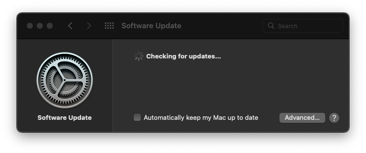

# Block Update Notifications

_**Some inexperienced users sometimes accidentally click on the Apple Software Update request in Notifications. These clickable Notifications appear even though all software updates are disabled in System Preferences.**_ - I am maintaining a number of hackintosh systems which I have set up with OpenCore that have such inexperienced users who then need help because something might have to be fixed after an unintentional macOS operating system or security update. I want to have full administrative control over all updates, but Apple does not make this easy. This is especially important for hackintosh systems, but could be relevant for regular Macs as well, especially since the Monterey update from 12.2.1 to 12.3 has caused serious issues with AMD 5000 and 6000 graphics cards for all users. - _You may not need this, if you are the only one using your hackintosh and pay close attention to every Notification._

## TL;DR

**The short answer is to install the** [**LuLu Application Firewall**](https://objective-see.com/products/lulu.html) **and** _**block**_ **the process** `softwareupdated` **when prompted. Re-enable it temporarily when you want to do manual updates.** I have tested this solution for a few weeks already and it works satisfactorily.

I have researched this topic and asked about it on [Stackexchange - Ask Different](https://apple.stackexchange.com/questions/437826/how-to-block-all-software-update-notifications-in-macos), but have not found a better solution yet.

### Detailed Step-by-Step

If you have previously used _Lulu_ or are using the _Little Snitch_ firewall, you probably do not need this much detail. This guide is mainly intended for first time users of _Lulu_.

The obvious first step is to completely disable all updates in _System Preferences_, but surprisingly this alone does not stop the clickable notifications.

 (1).png>)

#### Updates Ready to Install - still appears

This Notification has been appearing on many different versions of macOS even after all updates were disabled in _System Preferences_. A Notification similar to the following also appeared for Monterey 12.3 on a system that did not have Lulu installed yet.

.png>)

#### Download and Install Lulu

[Objective-See: LuLu Application Firewall](https://objective-see.com/products/lulu.html) - Big Sur is recommended for version 2.4. Also available is version 1.2 for older macOS versions.

#### Initially enable all firewall prompts

* _Lulu Preferences > Rules > Uncheck All,_ so that you will see all Firewall prompts initially.

.png>)

#### Trigger a Software Update Request

* System _Preferences > Software Updates > Advanced_ change any update setting to trigger a software update request

#### Block when asked

.png>)

#### Creates this Firewall rule

.png>)

#### Disable Software Updates

* In System _Preferences > Software Updates > Advanced_ - make sure that all software update settings are set to disabled

.png>)

#### Wait for the timeout, you should see:

.png>)

#### Allow most apps (minimizes unnecessary firewall prompts)

 (1).png>)

#### Manually Check for App Updates and/or macOS Updates

* In _Lulu > Rules_ search for _softwareupdated_ and temporarily allow software updates
* Double click on the rule and change to _Allow_

.png>)

#### Enable Software Updates Temporarily

* System _Preferences > Software Updates > Advanced_ activate the items you wish to update

 (1).png>)

#### Reenable the Firewall Rule blocking Software Updates

* In _Lulu > Rules_ search for _softwareupdated_ and block software updates again
* Double click on the rule and change to _Block_

.png>)

#### Disable Software Updates Again

* System _Preferences > Software Updates > Advanced_ deactivate all automatic updates again

.png>)

Note: this method may still not be idiot proof if a user uses System Preferences directly: I have seen the _Monterey 12.3 Software Update_ actually re-appear inside System Preferences after a while in spite of software updates being blocked by the firewall. This may be due to initial caching of the update information. - If you know of ways to make it even more idiot proof, please let me know in the comments.

