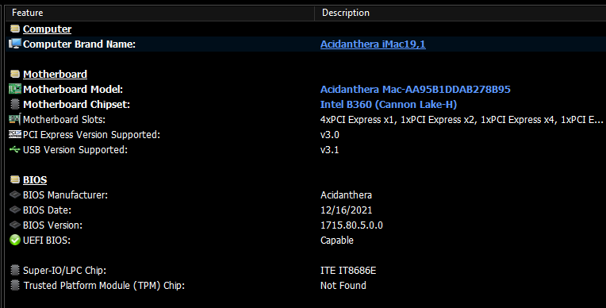

# Multi-Boot Options

## How to multi-boot macOS via OpenCore and Windows without affecting Windows at all?

### Use case: i9-10900 Esports Gaming System & Final Cut Pro Editing

Scenario: He is into professional Esports (Valorant) up to the national level and cannot allow OpenCore multi-booting to have any _(potential or real)_ effect on Windows at all. The Windows install is highly optimized and frequently reinstalled from scratch with very specific graphics and licensing settings. Any appearance of a hardware change after the optimized install can potentially mess things up, which he already experienced with a change to the Nvidia driver settings of the GeForce 1650 Super. On the macOS side requirements are simple: boot into macOS mainly for Final Cut Pro, Logic Pro and Adobe CC. No special requirements for exact Bootcamp like behaviour when rebooting. Getting a dGPU that is optimized for both macOS and Esports with live streaming is still a challenge. Therefore currently on MacOS only iGPU is used on two 1080p monitors. A RX 6600 XT would be a good option to fulfill all requirements.

### Four practical options to boot into Windows

#### 1. Booting Windows via OpenCore like Bootcamp (Dortania default)

This sets up Windows in a way which makes it behave like it is installed via Bootcamp on a real Mac.

#### 2. Booting Windows via OpenCore Custom-Mode

This boots Windows in a way which makes SMBIOS updates exclusive to macOS only, avoiding a collision with existing Windows activation and custom software.

#### 3. Booting Windows via rEFInd

This boots Windows in a way which is completely separate from OpenCore and rEFInd will have no effect on Windows.

#### 4. Booting Windows via BIOS Boot Menu

This boots Windows in a way which is completely separate as no other booters are involved.

### Detailed technical differences of the four options

Each option has advantages and disadvantages. What you choose depends on your use case.

#### 1. Booting Windows via OpenCore like Bootcamp (Dortania default)

This sets up Windows in a way which makes it behave like it is installed via Bootcamp on a real Mac. macOS and Windows can interact via _Startup Disk_ and _Bootcamp_ utilities to determine the OS to boot next.

Dortania DEFAULTS in Config.plist:

```
PlatformInfo > SMBIOS > UpdateSMBIOSMode = Create
OpenCore > Kernel > Quirks > CustomSMBIOSGuid = NO
```



**a) TECHNICAL DETAILS**

> * All the modifications applied (to ACPI, NVRAM, SMBIOS, etc.) are supposed to be operating system agnostic, i.e. apply equally regardless of the OS booted. This enables Boot Camp software experience on Windows. ...
> * Windows may need to be reactivated. To avoid it consider setting SystemUUID to the original firmware UUID. Be aware that it may be invalid on old firmware, i.e., not random. If there still are issues, consider using HWID or KMS38 license or making the use Custom UpdateSMBIOSMode. Other nuances of Windows activation are out of the scope of this document and can be found online.
> * Remember to always use the latest version of Windows support software from Boot Camp, as versions prior to 6.1 do not support APFS, and thus will not function correctly.\
>   _(Quotes are from the official OpenCore Reference Manual 0.7.8.:)_

Many other interactions with Windows are mentioned in the [Configuration.pdf](https://github.com/acidanthera/OpenCorePkg/blob/master/Docs/Configuration.pdf) _(OpenCore Reference Manual)_ when searching the document.

**b) EFFECT OF OPENCORE ON WINDOWS (ACPI)**

__[_Xiasl_](https://github.com/ic005k/Xiasl) found that four additional SSDT tables (as configured in OpenCore) had been loaded before loading Windows. As these tables all used conditionals like `If (_OSI ("Darwin"))` they did not have any apparent effect upon Windows. But a custom patched DSDT could cause a BSOD when booting Windows through OpenCore, as reported by users. Theoretically badly programmed SSDT patches could cause issues as well.

**c) EFFECT OF OPENCORE ON WINDOWS (HWiNFO64)**

When examining the differences on Windows using [HWiNFO64](https://www.hwinfo.com/download/) the following differences were noted: Windows loaded like it was installed on a Mac in Bootcamp with mainboard manufacturer name of Acidanthera and Mac serial numbers.

**Table 1: Data from HWiNFO64 Reports** _(obfuscated serials)_

This table illustrates how Windows perceives the hardware depending on boot mode.

|                                    |                                        |                                         |
| ---------------------------------- | -------------------------------------- | --------------------------------------- |
|                                    | **OpenCore Boot**                      | **Custom, rEFInd, BIOS Boot**           |
| _**MAINBOARD**_                    |                                        |                                         |
| **Mainboard Manufacturer**         | _Acidanthera_                          | _Gigabyte Technology Co., Ltd._         |
| **Mainboard Name**                 | _Mac-ABBBBBBBBBBBBBB5_                 | _B360 M AORUS PRO_                      |
| **Mainboard Version**              | _iMac19,1_                             | _x.x_                                   |
| **Mainboard Serial Number**        | _C099999999999999F_                    |                                         |
| _**SYSTEM**_                       |                                        |                                         |
| **System Manufacturer**            | _Acidanthera_                          | _Gigabyte Technology Co., Ltd._         |
| **Product Name**                   | _iMac19,1_                             | _B360 M AORUS PRO_                      |
| **Product Version**                | _1.0_                                  |                                         |
| **Product Serial Number**          | _C099999999999999F_                    |                                         |
| **UUID**                           | _08888882-7777-4444-3333-3CCCCCCCCCC1_ | _03333334-0000-5555-11111-8DDDDDDDDDD9_ |
| **Family**                         | _iMac_                                 |                                         |
| _**BIOS**_                         |                                        |                                         |
| **BIOS Manufacturer**              | _Acidanthera_                          | _American Megatrends Inc._              |
| **BIOS Date**                      | _12/16/2021_                           | _05/17/2019_                            |
| **BIOS Version**                   | _1715.80.5.0.0_                        | _F3_                                    |
| **UEFI BIOS**                      | Capable                                | Capable                                 |
| **BIOS Start Segment**             | _0_                                    | _F000_                                  |
| **BIOS Size**                      | 0 M_Bytes_                             | _16 MBytes_                             |
| **System BIOS Version**            | 5.13                                   | 5.13                                    |
| _**SYSTEM ENCLORUSE**_             |                                        |                                         |
| **Case Type**                      | _All in One_                           | _Desktop_                               |
| _**FIRMWARE VERSION INFORMATION**_ |                                        |                                         |
| **Reference Code - CPU**           |                                        | 7.0.49.52                               |
| **uCode Version**                  |                                        | 0.0.0.180                               |
| **TXT ACM version**                |                                        | 1.1.0.0                                 |
| _**J6B2**_                         |                                        |                                         |
| Slot Designation                   | J6B2                                   | J6B2                                    |
| Slot Type                          | PCI Express                            | PCI Express                             |
| Slot Usage                         | _Empty_                                | _In use_                                |

#### 2. Booting Windows via OpenCore Custom-Mode

This boots Windows in a way which makes SMBIOS updates exclusive to macOS only, avoiding a collision with existing Windows activation and custom software, but BootCamp specific tools like the OS switcher in Windows might not work any more. When booting macOS through OpenCore, no significant changes were observed.

CHANGES in Config.plist:

```
PlatformInfo > SMBIOS > UpdateSMBIOSMode = Custom
OpenCore > Kernel > Quirks > CustomSMBIOSGuid = YES
```

**a) TECHNICAL DETAILS**

> `UpdateSMBIOSMode Custom` — WriteSMBIOStables to work around firmware overwriting SMBIOS contents at ExitBootServices. ...\
> Note: A side effect of using the Custom approach that it makes SMBIOS updates exclusive to macOS, avoiding a collision with existing Windows activation and custom OEM software but potentially obstructing the operation of Apple-specific tools.\
> `CustomSMBIOSGuid Yes` — Performs GUID patching for UpdateSMBIOSMode Custom mode.\
> _(Quotes are from the official OpenCore Reference Manual 0.7.8.:)_

**b) EFFECT OF OPENCORE-CUSTOM-MODE ON WINDOWS (ACPI)**

__[_Xiasl_](https://github.com/ic005k/Xiasl) found that four additional SSDT tables (as configured in OpenCore) had been loaded before loading Windows. As these tables all used conditionals like `If (_OSI ("Darwin"))` they did not have any apparent effect upon Windows. But a custom patched DSDT could cause a BSOD when booting Windows through OpenCore, as reported by one user. Theoretically badly programmed SSDT patches could cause issues as well.

**c) EFFECT OF OPENCORE-CUSTOM-MODE ON WINDOWS (HWiNFO64)**

When examining the differences on Windows using HWiNFO64 the following was noted: Windows appeared to load completely unchanged from loading Windows via rEFInd or via BIOS direct. No Mac specifics leaked into Windows.

_**See details in Table 1**_

#### 3. Booting Windows via rEFInd

This boots Windows in a way which is completely separate from OpenCore and rEFInd will have no effect on Windows. When selecting the Mac Option in rEFInd, OpenCore is chain-loaded.

Configuration of rEFInd will be discussed in the next Chapter.

**a) EFFECT OF rEFInd ON WINDOWS (ACPI)**

_Xiasl_ found no additional SSDT tables, as rEFInd makes no such changes.

**b) EFFECT OF rEFInd ON WINDOWS (HWiNFO64)**

When examining the differences on Windows using HWiNFO64 the following was noted: Windows loaded completely unchanged from loading Windows via BIOS direct, as rEFInd makes no changes. No Mac specifics are able to leak into Windows.

_**See details in Table 1**_

#### 4. Booting Windows via BIOS Boot Menu

This boots Windows in a way which is completely separate as no other booters are involved. OpenCore is on the macOS drive and will only load when its disk is selected.

**a) EFFECT OF BIOS ON WINDOWS (ACPI & HWiNFO64)**

Since Windows loads via BIOS direct, the macOS disk has no effect at all upon the Windows ACPI tables or upon the Windows configuration. No Mac specifics are able to leak into Windows.

_**See details in Table 1**_

### Advantages and disadvantages:

For the initially described Esports Gaming & Final Cut Pro Editing use case, only the rEFInd or the BIOS Boot Menu options are safe. But for most people booting Windows via OpenCore (Option 1 or 2) are the recommended choices.

1. If you want the BootCamp experience with Windows, use Option 1, as intended by the OpenCore developers. No changes to your Config.plist are necessary. You will be able to use the _Apple BootCamp_ utility and the _Startup Disk_ to switch between Windows and macOS. Windows might need to be re-activated or may be difficult to activate. Some Windows apps might require your action due to the apparent hardware change.
2. If you want Windows (largely) unaffected by OpenCore, use Option 2 with Custom Mode. Make the required changes to your Config.plist and check that none of your SSDTs or Quirks impact Windows. Some of the BootCamp style integration between OpenCore and Windows might be lost.
3. If you want to be absolutely sure that even a misconfigured OpenCore cannot effect your Windows configuration, use Option 3 with rEFInd and follow the installation guide below. The macOS _StartUp Disk_ setting will no be able to influence which operating system is started by rEFInd, but for example different versions of macOS on the same computer can still be set via StartUp disk.
4. If you don't want to bother with installing rEFInd, but still want to be absolutely sure that even a misconfigured OpenCore cannot _a_ffect your Windows configuration, use Option 4 with BIOS F12 Boot. You might forget to press the F12 button on time and boot to the wrong OS. In some setups with iGPU and a macOS disabled dGPU, this option is quite cumbersome and prone to user error.
