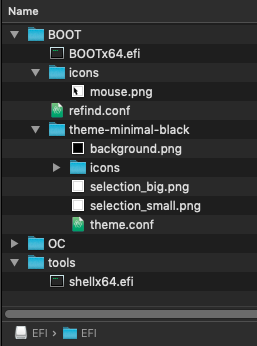
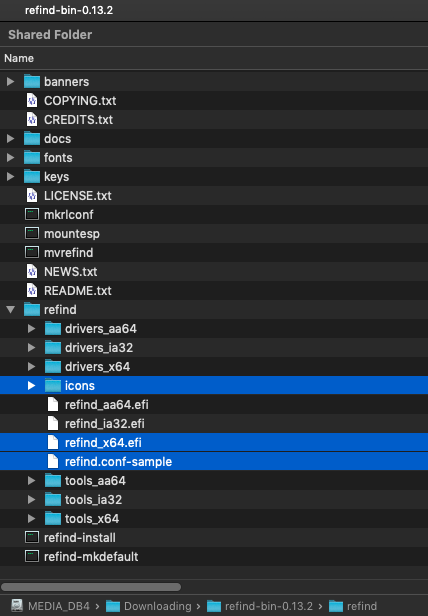

# Create rEFInd BOOT

## Create rEFInd BOOT for OpenCore

### rEFInd installation

#### Prerequisites:

* Proper BIOS settings for OpenCore as described in the [Dortania OpenCore Install Guide](https://dortania.github.io/OpenCore-Install-Guide/).
* One disk with a self-contained UEFI Windows installation.
* One disk with a self-contained macOS installation, with the OpenCore boot-loader located on the same macOS disk.
* Both Windows and macOS can successfully boot from the BIOS boot menu and from OpenCore.

### TL;DR

If you do not want to create the rEFInd folder from scratch, you may use my preconfigured rEFInd BOOT folder. For security, you can verify the included binary from ( `refind-bin-0.13.2.zip` from [rEFInd Boot Manager](https://www.rodsbooks.com/refind/) for authenticity using a SHA1 hash tool.

```
BOOTx64.efi  refind_x64.efi  b02ff7452a1c70ec527908b902cff4f63a8728b7
```

* Download the compressed rEFInd BOOT folder and unzip it: [BOOT.zip · chriswayg/hackintosh-opencore · GitHub](https://github.com/chriswayg/hackintosh-opencore/blob/master/rEFInd-BOOT-folder/BOOT.zip)
* Backup your active EFI, or use a separate USB drive for testing.
* Delete the current BOOT folder and copy the rEFInd BOOT folder to your EFI folder.
* If needed, open the rEFInd configuration `refind.conf` and adjust some settings. Settings are documented in `refind.conf-sample` and on with some important settings explained below.
* Optionally create a tools folder in `EFI/tools` and copy `OpenShell.efi` from OpenCore into it renaming it to `shellx64.efi`
* Your EFI folder should now look like this:



### Get rEFInd

* Documentation: [The rEFInd Boot Manager](http://www.rodsbooks.com/refind/)
* Download: [rEFInd download | SourceForge.net](https://sourceforge.net/projects/refind/)
  * `refind-bin-0.13.2.zip or newer`
* Download a compatible UEFI Shell: (optional)
  * [edk2/Shell\_Full.efi](https://github.com/tianocore/edk2/blob/UDK2018/EdkShellBinPkg/FullShell/X64/Shell\_Full.efi)

### Setup rEFInd with OpenCore



* Copy `icons refind_x64.efi refind.conf-sample` as shown above to EFI/BOOT/
* delete all icons except `mouse.png`
* delete `BOOTx64.efi`
* rename `refind_x64.efi` to `BOOTx64.efi`
* copy `refind.conf-sample` to `refind.conf`
* Update the refind.conf configuration as shown below (without comments)

```
# refind.conf
# Configuration file for the rEFInd boot menu

timeout    5
use_nvram  false

hideui hints,arrows,badges

resolution    1920 1080
enable_mouse
#mouse_speed  4

use_graphics_for  osx, linux, windows
showtools         reboot, shutdown, about
scanfor           internal, manual

dont_scan_files    /EFI/BOOT/BOOTx64.efi, /EFI/OC/OpenCore.efi
default_selection  macOS

menuentry "macOS" {
    ostype   "MacOS"
    graphics "on"
    icon     /EFI/BOOT/theme-minimal-black/icons/os_mac.png
    volume   "EFI"
    loader   /EFI/OC/OpenCore.efi
}

include theme-minimal-black/theme.conf
```

### Theme rEFInd-minimal-black

* Download the theme rEFInd-minimal-black [GitHub - chriswayg/rEFInd-minimal-black: A stunningly clean black theme for the rEFInd UEIF boot manager.](https://github.com/chriswayg/rEFInd-minimal-black)
* Rename `theme-minimal-black-master` to `theme-minimal-black`
* Delete `README.md` and `screenshot.png`
* Update the config as shown below

```
# A minimal dark refind theme

icons_dir     theme-minimal-black/icons
banner        theme-minimal-black/background.png
banner_scale  fillscreen

selection_big   theme-minimal-black/selection_big.png
selection_small theme-minimal-black/selection_small.png
```

* move the `theme-minimal-black` folder into BOOT

### Configurations with comments

#### refind.conf with some comments

Check the `refind.conf-sample` for the fully commented version

```
# refind.conf
# Configuration file for the rEFInd boot menu

# Timeout in seconds for the main menu screen.
timeout 5

# Whether to store rEFInd's rEFInd-specific variables in NVRAM
# - setting it to true seemed to interfere with OpenCore
# - only the last booted entry is saved in a text file
use_nvram false

# Hide user interface elements for personal preference or to increase
# security:
#  banner      - the rEFInd title banner (built-in or loaded via "banner")
#  label       - boot option text label in the menu
#  singleuser  - remove the submenu options to boot macOS in single-user
#                or verbose modes; affects ONLY macOS
#  safemode    - remove the submenu option to boot macOS in "safe mode"
#  hwtest      - the submenu option to run Apple's hardware test
#  arrows      - scroll arrows on the OS selection tag line
#  hints       - brief command summary in the menu
#  editor      - the options editor (+, F2, or Insert on boot options menu)
#  badges      - device-type badges for boot options
#  all         - all of the above
# Default is none of these (all elements active)

hideui hints,arrows,badges

# Set the screen's video resolution.
# - change this to your preferred UI resolution
resolution 1920 1080

# This does not work as well as the mouse in OpenCore
# - try, if it works on your system
#enable_mouse
# Size of the mouse pointer, in pixels, per side.
#mouse_size 16
# Speed of mouse tracking. Higher numbers equate to faster
# mouse movement.
#mouse_speed 4

# Launch specified OSes in graphics mode. By default, rEFInd switches
# to text mode and displays basic pre-launch information when launching
# all OSes except macOS.
# Valid options:
#   osx     - macOS
#   linux   - A Linux kernel with EFI stub loader
#   elilo   - The ELILO boot loader
#   grub    - The GRUB (Legacy or 2) boot loader
#   windows - Microsoft Windows
# Default value: osx
# - this setting whould not be changed

use_graphics_for osx, linux, windows

# Which non-bootloader tools to show on the tools line, and in what
# order to display them:
#  shell            - the EFI shell (requires external program; see rEFInd
#                     documentation for details)
#  memtest          - the memtest86 program, in EFI/tools, EFI/memtest86,
#                     EFI/memtest, EFI/tools/memtest86, or EFI/tools/memtest
#  gptsync          - the (dangerous) gptsync.efi utility (requires external
#                     program; see rEFInd documentation for details)
#  gdisk            - the gdisk partitioning program
#  apple_recovery   - boots the Apple Recovery HD partition, if present
#  windows_recovery - boots an OEM Windows recovery tool, if present
#                     (see also the windows_recovery_files option)
#  mok_tool         - makes available the Machine Owner Key (MOK) maintenance
#                     tool, MokManager.efi, used on Secure Boot systems
#  csr_rotate       - adjusts Apple System Integrity Protection (SIP)
#                     policy. Requires "csr_values" to be set.
#  about            - an "about this program" option
#  hidden_tags      - manage hidden tags
#  exit             - a tag to exit from rEFInd
#  shutdown         - shuts down the computer (a bug causes this to reboot
#                     many UEFI systems)
#  reboot           - a tag to reboot the computer
#  firmware         - a tag to reboot the computer into the firmware's
#                     user interface (ignored on older computers)
#  fwupdate         - a tag to update the firmware; launches the fwupx64.efi
#                     (or similar) program
#  netboot          - launch the ipxe.efi tool for network (PXE) booting
# Default is shell,memtest,gdisk,apple_recovery,windows_recovery,mok_tool,about,hidden_tags,shutdown,reboot,firmware,fwupdate
#- shell icon will only be shown if found in the tools folder

showtools  shell, reboot, shutdown, about

# Which types of boot loaders to search, and in what order to display them:
#  internal      - internal EFI disk-based boot loaders
#  external      - external EFI disk-based boot loaders
#  manual        - use stanzas later in this configuration file
# - add external, if you want to load an OS from an external disk

scanfor internal, manual

# Files that should NOT be included as EFI boot loaders (on the
# first line of the display).
# - this ensures that these are not shown as additional boot options

dont_scan_files /EFI/BOOT/BOOTx64.efi, /EFI/OC/OpenCore.efi

# Set the default menu selection.
# - change this to 'Microsoft' if you want to make Windows the default
# - comment out if you want rEFInd to boot the last used OS
default_selection macOS

# Manual configuration stanza. 
# - if preffered rename this to 'OpenCore' and use a OpenCore icon
menuentry "macOS" {
    ostype "MacOS"
    graphics "on"
    icon /EFI/BOOT/theme-minimal-black/icons/os_mac.png
    volume "EFI"
    loader /EFI/OC/OpenCore.efi
}

# the theme configuration is loaded from this file.
# - Change if you use a different thenm
include theme-minimal-black/theme.conf
```

#### theme.conf with comments

```
# A minimal dark refind theme
# - leave as is; no changes are needed here.

# Set the name of a subdirectory in which icons are stored. 
icons_dir theme-minimal-black/icons

# Use a custom title banner instead of the rEFInd icon and name. 
banner theme-minimal-black/background.png

# Tells rEFInd whether to display banner images pixel-for-pixel (noscale)
# or to scale banner images to fill the screen (fillscreen).
banner_scale fillscreen

# Custom images for the selection background. There is a big one (144 x 144)
# for the OS icons, and a small one (64 x 64) for the function icons in the
# second row.
selection_big   theme-minimal-black/selection_big.png
selection_small theme-minimal-black/selection_small.png
```

### Versions

* Windows 10 21H1
* macOS Mojave 10.14.6
* OpenCore 0.7.8
* rEFInd 0.13.2
