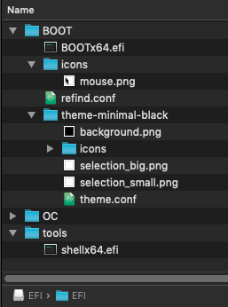
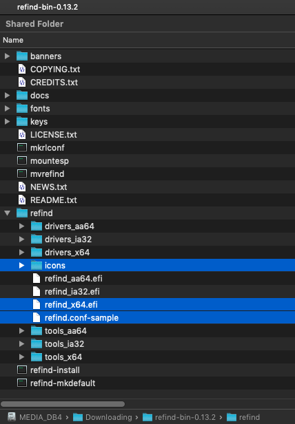

# Create rEFInd BOOTer

## Create rEFInd BOOT folder for OpenCore

With this guide you will install rEFInd on the same EFI partition and into the same EFI folder as OpenCore. rEFInd will give you the choice of loading Windows directly or macOS via OpenCore. The advantage of loading Windows this way is, that it makes it impossible for OpenCore to interfere with the Windows configuration. Almost all rEFInd files are self-contained in the preconfigured BOOT folder.

### rEFInd installation

#### Prerequisites:

* Proper BIOS settings for OpenCore as described in the [Dortania OpenCore Install Guide](https://dortania.github.io/OpenCore-Install-Guide/).
* One disk with a self-contained UEFI Windows installation.
* One disk with a self-contained macOS installation, with the OpenCore boot-loader located on the same macOS disk.
* Ensure that Windows can successfully boot from the BIOS boot-menu and that macOS can successfully boot via OpenCore.
* OpenCore can be configured with its boot menu or with the OpenCanopy GUI. You may also hide disable the OpenCore Picker and set macOS as default. It is recommended to at least hide the Windows option in OpenCore.

### TL;DR

You may use my preconfigured rEFInd BOOT folder to get started quickly. You can verify the included `BOOTx64.efi (refind_x64.efi)` binary  which originates from `refind-bin-0.13.2.zip` for authenticity by using a SHA1 hash tool. The original files can be downloaded from [SourceForge](https://sourceforge.net/projects/refind/) for comparison.

```
BOOTx64.efi  refind_x64.efi  b02ff7452a1c70ec527908b902cff4f63a8728b7
```

* Backup your active EFI, or use a separate USB drive for testing.
* Download the compressed rEFInd BOOT folder with _tools_ and unzip it: [rEFInd-BOOT-folder.zip · chriswayg/hackintosh-opencore · GitHub](https://github.com/chriswayg/hackintosh-opencore/blob/master/rEFInd-BOOT-folder.zip)
* Delete the current `EFI/BOOT` folder and copy the rEFInd `BOOT` folder into your EFI folder to `EFI/BOOT` .
* Optionally copy the `tools` folder with the UEFI Shell to `EFI/tools.` _(The `shellx64.efi` file is a renamed `OpenShell.efi` from_ [_OpenCore 0.7.8_](https://github.com/acidanthera/OpenCorePkg/releases) _with SHA1: `44056c64bb05a22d02ed362cc36e6d4e04417e36`.)_
* If needed, open the rEFInd configuration `refind.conf` and adjust some settings. Settings are documented in `refind.conf-sample` with some important settings explained below.
* You may delete `screenshot.png`, `README.md` and the `.conf-sample` files.
* Your EFI folder should now look similar to this:



### Manually create the rEFInd BOOT folder

Create the rEFInd BOOT folder from scratch by downloading rEFInd, a theme and customizing your configuration.

### Get rEFInd

* Documentation: [The rEFInd Boot Manager](http://www.rodsbooks.com/refind/)
* Download: [rEFInd download | SourceForge.net](https://sourceforge.net/projects/refind/)
  * `refind-bin-0.13.2.zip` or newer

### Setup rEFInd with OpenCore



* copy `icons` , `refind_x64.efi` and `refind.conf-sample` as shown above to `EFI/BOOT/`
* delete all icons except `mouse.png`
* delete `BOOTx64.efi`
* rename `refind_x64.efi` to `BOOTx64.efi`
* copy `refind.conf-sample` to `refind.conf`
* Update the `refind.conf` configuration as shown below and adapt it for your use

```
# refind.conf
# Configuration file for the rEFInd boot menu

timeout      5
use_nvram    false

#resolution   1920 1080

use_graphics_for   osx, linux, windows
showtools          shell, reboot, shutdown, about
scanfor            internal, manual

dont_scan_files    /EFI/BOOT/BOOTx64.efi, /EFI/OC/OpenCore.efi, /EFI/Microsoft/Boot/bootmgfw.efi
default_selection  OpenCore

menuentry "Windows" {
    loader /EFI/Microsoft/Boot/bootmgfw.efi
}

menuentry "OpenCore" {
    ostype   "MacOS"
    graphics "on"
    icon     /EFI/BOOT/theme-minimal-black/icons/os_opencore.png
    volume   "EFI"
    loader   /EFI/OC/OpenCore.efi
}

include theme-minimal-black/theme.conf
```

* You may delete the `.conf-sample` file.

### Theme rEFInd-minimal-black

* Adding a theme is highly recommended as the default theme of rEFInd looks horrible. There are many other attractive themes on GitHub such as the light version of this minimal theme.
* Download [theme-minimal-black: A stunningly clean black theme for the rEFInd UEIF boot manager - Hackintosh edition](https://github.com/chriswayg/theme-minimal-black/archive/refs/heads/master.zip).
* Rename `theme-minimal-black-master` to `theme-minimal-black`
* You may delete `screenshot.png` and `README.md`
* Update the theme.config as shown below:

```
# A minimal dark refind theme

hideui          hints, arrows, badges
icons_dir       theme-minimal-black/icons
banner          theme-minimal-black/background.png
banner_scale    fillscreen

selection_big   theme-minimal-black/selection_big.png
selection_small theme-minimal-black/selection_small.png
```

* move the `theme-minimal-black` folder into BOOT

#### Enable UEFI Shell (optional)

* Download a copy of a [compatible UEFI Shell](https://wiki.archlinux.org/title/Unified\_Extensible\_Firmware\_Interface#UEFI\_Shell), preferably the version that is found in the _Tools_ folder of the  [OpenCore](https://github.com/acidanthera/OpenCorePkg/releases/tag/0.7.8) Release.
* Create a `tools` folder in `EFI/tools.` Copy `OpenShell.efi` into `EFI/tools`.
* Rename `OpenShell.efi` to `shellx64.efi`

### Configurations with comments

#### refind.conf with comments

Check the `refind.conf-sample` for the original fully commented version

```
# refind.conf
# Configuration file for the rEFInd boot menu

# Timeout in seconds for the main menu screen.
# Setting the timeout to 0 disables automatic booting.
timeout 5

# Whether to store rEFInd's rEFInd-specific variables in NVRAM
# - setting it to true seemed to interfere with OpenCore
# - the last booted entry is saved in a text file when not using nvram
use_nvram false

# Set the screen's video resolution.
# - change this to your preferred UI resolution
# - or comment out for automatic resolution settiing by rEFInd
resolution 1920 1080

# This does not work as well as the mouse in OpenCore
# - try, if it works on your system
#enable_mouse
# Size of the mouse pointer, in pixels, per side.
#mouse_size 16
# Speed of mouse tracking. Higher numbers equate to faster
# mouse movement.
#mouse_speed 4

# Launch specified OSes in graphics mode. By default, rEFInd switches
# to text mode and displays basic pre-launch information when launching
# all OSes except macOS.
# Valid options:
#   osx     - macOS
#   linux   - A Linux kernel with EFI stub loader
#   elilo   - The ELILO boot loader
#   grub    - The GRUB (Legacy or 2) boot loader
#   windows - Microsoft Windows
# Default value: osx
# - keep this setting as is!

use_graphics_for osx, linux, windows

# Which non-bootloader tools to show on the tools line, and in what
# order to display them:
#  shell            - the EFI shell (requires external program; see rEFInd
#                     documentation for details)
#  memtest          - the memtest86 program, in EFI/tools, EFI/memtest86,
#                     EFI/memtest, EFI/tools/memtest86, or EFI/tools/memtest
#  gptsync          - the (dangerous) gptsync.efi utility (requires external
#                     program; see rEFInd documentation for details)
#  gdisk            - the gdisk partitioning program
#  apple_recovery   - boots the Apple Recovery HD partition, if present
#  windows_recovery - boots an OEM Windows recovery tool, if present
#                     (see also the windows_recovery_files option)
#  mok_tool         - makes available the Machine Owner Key (MOK) maintenance
#                     tool, MokManager.efi, used on Secure Boot systems
#  csr_rotate       - adjusts Apple System Integrity Protection (SIP)
#                     policy. Requires "csr_values" to be set.
#  about            - an "about this program" option
#  hidden_tags      - manage hidden tags
#  exit             - a tag to exit from rEFInd
#  shutdown         - shuts down the computer (a bug causes this to reboot
#                     many UEFI systems)
#  reboot           - a tag to reboot the computer
#  firmware         - a tag to reboot the computer into the firmware's
#                     user interface (ignored on older computers)
#  fwupdate         - a tag to update the firmware; launches the fwupx64.efi
#                     (or similar) program
#  netboot          - launch the ipxe.efi tool for network (PXE) booting
# Default is shell,memtest,gdisk,apple_recovery,windows_recovery,mok_tool,about,hidden_tags,shutdown,reboot,firmware,fwupdate
# - the shell icon will only be shown if found in the tools folder

showtools  shell, reboot, shutdown, about

# Which types of boot loaders to search, and in what order to display them:
#  internal      - internal EFI disk-based boot loaders
#  external      - external EFI disk-based boot loaders
#  manual        - use stanzas later in this configuration file
# - add external, if you want to load an OS from an external disk

scanfor internal, manual

# Files that should NOT be included as EFI boot loaders (on the
# first line of the display).
# - this ensures that these efis are not shown as additional boot options

dont_scan_files    /EFI/BOOT/BOOTx64.efi, /EFI/OC/OpenCore.efi, /EFI/Microsoft/Boot/bootmgfw.efi

# Set the default menu selection.
# - change this to 'Microsoft' if you want to make Windows the default
# - comment out if you want rEFInd to boot the last used OS
default_selection macOS

# Manual configuration stanzas. 

# this will normally be found automatically by rEFInd
# Use this to giove it a more meaningful name than 'Microsoft'
menuentry "Windows" {
    loader /EFI/Microsoft/Boot/bootmgfw.efi
}


# - if preffered rename this to 'OpenCore' and use a OpenCore icon
menuentry "macOS" {
    ostype "MacOS"
    graphics "on"
    icon /EFI/BOOT/theme-minimal-black/icons/os_mac.png
    volume "EFI"
    loader /EFI/OC/OpenCore.efi
}

# the theme configuration is loaded from this file.
# - Change if you use a different theme
include theme-minimal-black/theme.conf
```

#### theme.conf with comments

```
# A minimal dark refind theme

# Hide user interface elements for personal preference or to increase
# security:
#  arrows      - scroll arrows on the OS selection tag line
#  hints       - brief command summary in the menu
#  badges      - device-type badges for boot options
hideui hints, arrows, badges

# Set the name of a subdirectory in which icons are stored. 
icons_dir theme-minimal-black/icons

# Use a custom title banner instead of the rEFInd icon and name. 
banner theme-minimal-black/background.png

# Tells rEFInd whether to display banner images pixel-for-pixel (noscale)
# or to scale banner images to fill the screen (fillscreen).
banner_scale fillscreen

# Custom images for the selection background. There is a big one (144 x 144)
# for the OS icons, and a small one (64 x 64) for the function icons in the
# second row.
selection_big   theme-minimal-black/selection_big.png
selection_small theme-minimal-black/selection_small.png
```

### Versions

* rEFInd 0.13.2 (this does not change often)
* OpenCore 0.7.8 (the rEFInd BOOT folder should work without changes in future OpenCore versions)
* macOS Mojave 10.14.6 (any OpenCore bootable macOS version should work)
* Windows 10 - 21H1 (presumably Windows 11 works just as well)

 _Except where otherwise noted, content on this site is licensed under the_ [_Creative Commons — Attribution-NonCommercial 4.0 International — CC BY-NC 4.0_](https://creativecommons.org/licenses/by-nc/4.0/) _license. Attribution by link to_ [_chriswayg · GitHub_](https://github.com/chriswayg)_._
