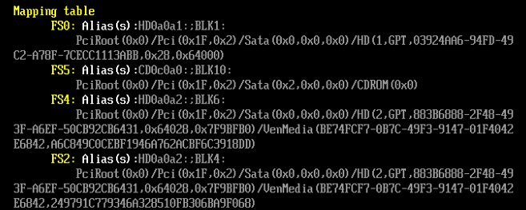
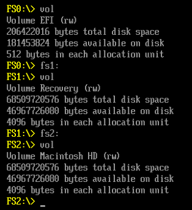
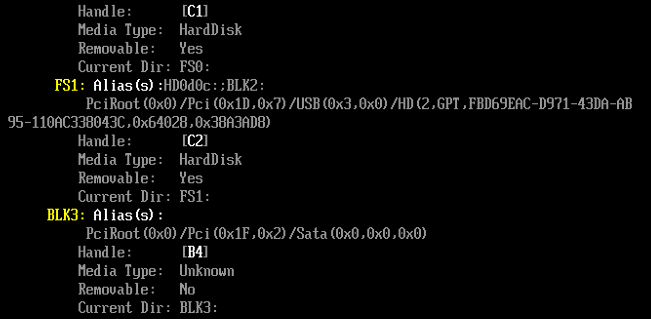
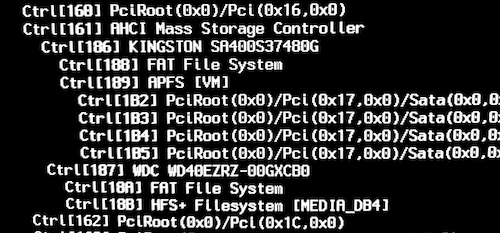
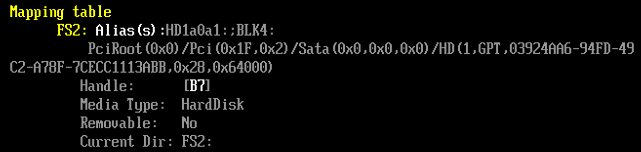
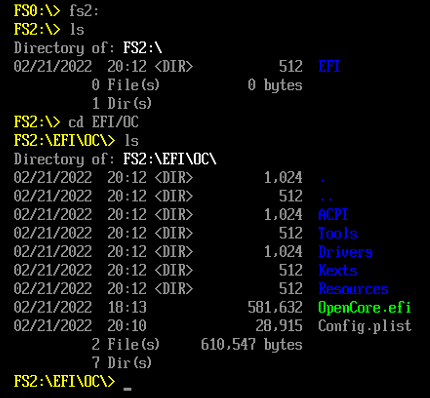
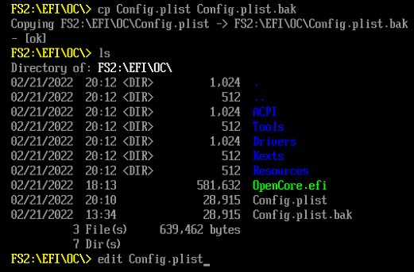
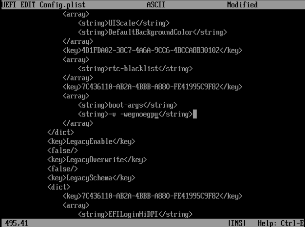

# OpenCore UEFI Shell

## OpenCore UEFI Shell for Hackintosh troubleshooting

You may have never used the OpenCore UEFI Shell before. Here is a little Hackintosh focused introduction.

* The OpenCore UEFI Shell can be used for
  * editing Config.plist, even when Hackintosh is unbootable
  * restoring a Config.plist or an EFI folder from backup
  * finding full device partition paths for Windows & Linux boot entries
  * dumping your DSDT
  * checking devices
  * just for fun, to take a closer look under the hood

You have access to the builtin _OpenShell.efi_ which is intended for fixing and troubleshooting. - Press the _space bar_ and then select _OpenShell_ from the OpenCore boot menu or the GUI:

.png>)

You will be greeted with a _Mapping table_ showing partitions named FS0, FS1, FS2, etc.&#x20;



The command-line interface has many similarities with the macOS BSD-Unix based CLI and other CLIs which you may know from Windows or Linux. Some of the basic commands are very similar, while others are unique to the UEFI Shell.

Type `fs0:` to make the root of the partition the active directory. Type `vol` to check what partition you are on. Then type `ls` to list the files. You may be able to recognise this as the EFI partition of the main macOS drive or it could be a different partition, for example if you have USB drives plugged in.&#x20;



If you have newly plugged in a USB drive, refresh the mapping table by typing `map -r`. To see more details of the storage devices, type the `map -v -b` command. (`-v` gives more _verbose_ output and `-b` will _break_ the output of the command into screens to allow you to read it all)



In this example you can more easily find a USB drive partition (_FS0 and FS1_) by looking for the _Removable: Yes_ devices.

Next use the command `devtree -b` to look for the location of the EFI partition on the main macOS drive. As my screenshots come from within a Parallels VM, the device names are different than what will be displayed on a Hackintosh. Under Mojave-0 the first _FAT File System_ should be our EFI partition. The handle is `B7`.

 (1) (1) (1) (1).png>)

On a Hackintosh, you will likely see the name of the storage drive manufacturer, for example _Kingston_ or _WDC_, which will make the partition handles easier to locate.&#x20;



We can find the `B7` handle in the Mapping Table by using the command `map -b -v`&#x20;



After having confirmed the identity of the partition, we can now make the root of the FS2 partition the active directory by typing `fs2:` and listing its files with `ls`. Change directory with `cd efi\oc` into your OC directory



Before making changes, backup at least your Config.plist with the command `cp Config.plist Config.plist.bak`&#x20;



Alternatively backup your complete EFI folder, which may take a little while...

```
cd \
mkdir bak
cp -r EFI bak
```

Then type `edit Config.plist`. Scenario: Maybe you cannot boot, because you forgot to exclude your dGPU (a dedicated Nvidia 1660 card) in the _boot-args_ . Therefore in this hypothetical example we will make a small change to the `boot-args` to exclude the dedicated GPU by adding `-wegnoegpu` . - Scroll down to the NVRAM section by using the _page down_ key. Then edit the string to look like is shown below. (Don't do this for real, if you actually use your dedicated GPU, as this is just for illustration purposes. Instead just add or delete the verbose setting `-v`, if you want to make a minimal edit.)



Save the changes by pressing `Ctrl S` or `F2` and then `Enter`. Exit the editor with `Ctrl Q` or `F3` . To test your changes type `reset`, which will restart your Hackintosh with these new settings.

If you are able to find your main EFI partition quickly (try `fs0:`and then `vol` first), these kind of changes can be made within less than a minute. It does take a while to learn and memorize some of the commands though.

To list all commands type `help -b`. Then get more detailed help for a specific command, for example by typing `drivers -? -b`

### Useful Commands

**File related & commonly used commands**

```
cd, ls, cp, mv, mkdir, rm, cls
help -b
edit file.name
map -v -b
devtree -b
vol
ver
reset
```

**Device & driver related commands**

```
acpiview
devices
dh
drivers
memmap
pci
smbiosview
```

[**acpiview**](opencore-uefi-shell/acpiview.md) is able to display and dump ACPI table information.

**Redirect command output to text file**

You should be able to redirect the output of most commands to a file. For example, to be able to use full device partition paths for Windows & Linux boot entries in _OpenCore -> Config.plist -> Misc -> Entries,_ it will be useful to save the data to a file in the current directory.&#x20;

```
map -v > mapping.txt
```

There are many more commands to explore and you may use the linked documentation below.

### Links

* Introduction to basic commands: [How to Use UEFI Interactive Shell and Its Common Commands](https://linuxhint.com/use-uefi-interactive-shell-and-its-common-commands/#9)
* [Dualbooting with Linux - Identifying your UEFI paths and devices | OpenCore Multiboot](https://dortania.github.io/OpenCore-Multiboot/oc/linux.html#method-c-chainloading-the-kernel-must-support-efistub)
* [Getting a copy of your DSDT via UEFI Shell | Getting Started With ACPI](https://dortania.github.io/Getting-Started-With-ACPI/Manual/dump.html#uefi-shell)
* Official UEFI Manual: [Specifications | Unified Extensible Firmware Interface Forum](https://uefi.org/specifications)
  * **All UEFI Shell commands:** [**UEFI Shell Specification Version 2.2**](http://www.uefi.org/sites/default/files/resources/UEFI\_Shell\_2\_2.pdf)
    * see from page 87 for command reference
  * Thousands of pages: [UEFI Specification Version 2.9 (March 2021)](https://uefi.org/sites/default/files/resources/UEFI\_Spec\_2\_9\_2021\_03\_18.pdf)

 _Except where otherwise noted, content on this site is licensed under the_ [_Creative Commons — Attribution-NonCommercial 4.0 International — CC BY-NC 4.0_](https://creativecommons.org/licenses/by-nc/4.0/) _license. Attribution by link to_ [_chriswayg · GitHub_](https://github.com/chriswayg)_._
