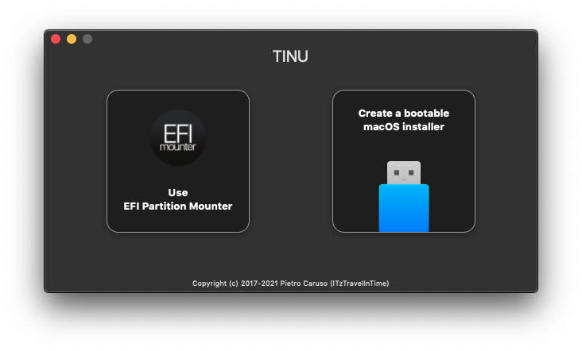
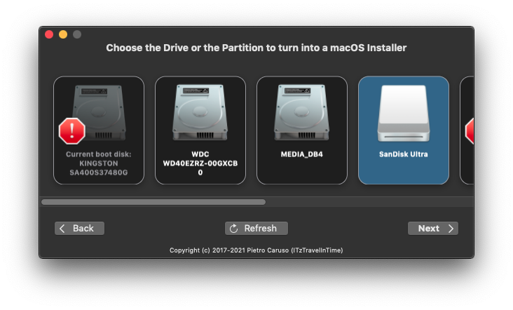
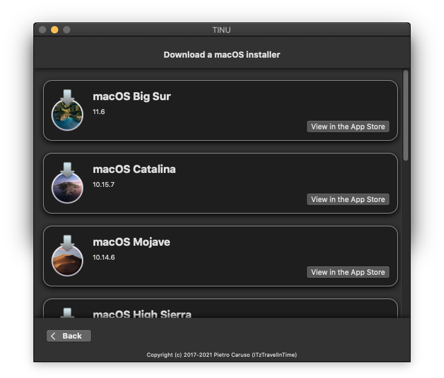
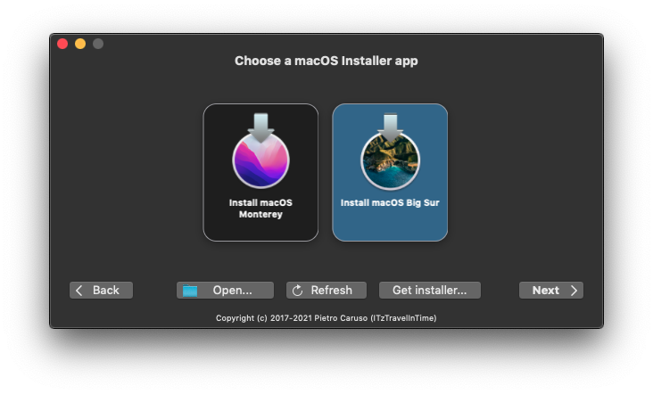
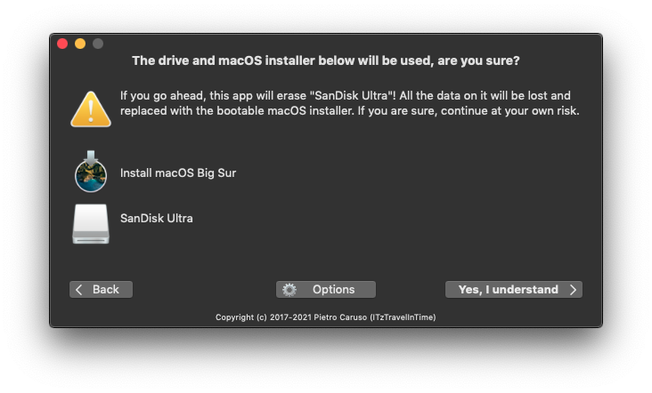
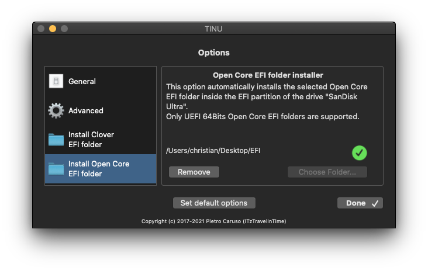

# Create macOS Installer - TINU

## Create a bootable installer for macOS with TINU

TINU is a very useful opensource GUI for the `createinstallmedia` command, together with some useful tools such as an EFI mounter, the macOS Downloader and the OpenCore EFI-folder integration.

* Download [TINU: The open tool to create bootable macOS installers.](https://github.com/ITzTravelInTime/TINU)
* Plug in a 16GB+ USB-stick
* Launch TINU and click _Create a bootable macOS installer_



* Click on _Proceed_ and choose the target USB-stick. Then click _Next_



* Click on _Get Installer_



* Try to download _Big Sur_ from the App Store by using the provided link within TINU.
*   If you are unable to download from the App Store, follow [Making the installer in macOS](https://dortania.github.io/OpenCore-Install-Guide/installer-guide/mac-install.html#downloading-macos-modern-os), by using the following command in the Terminal (you will need at least 50GB of available disk space):

    ```
    mkdir -p ~/macOS-installer && cd ~/macOS-installer && curl https://raw.githubusercontent.com/munki/macadmin-scripts/main/installinstallmacos.py > installinstallmacos.py && sudo python installinstallmacos.py
    ```

    * Once finished, you’ll find a DMG in your `~/macOS-Installer/` folder containing the macOS Installer, called `Install_macOS_11.5.2-20G95.dmg` for example. Mount it and you’ll find the installer application.
* Open the installer application for macOS Big Sur inside TINU and click _Next_





* Click _Options_ and add the EFI folder which you previously created in _OCAuxiliaryTools_ from the Desktop



* Click _Done_ and start creating the macOS installer by clicking on _**Yes, I understand**_.
* This will take a number of minutes. You can check the log for details.

This step completes the creation of a hackintosh bootable USB drive with the macOS installer and the OpenCore EFI folder on it. - You may want to add some tools such as _OCAuxiliaryTools_ and _EFI-Agent_ to the USB drive, as these will be useful during post-install configuration.

**Next follow the steps on the** [**Install & Postinstall**](../step-by-step/install-postinstall.md) **page!**

 _Except where otherwise noted, content on this site is licensed under the_ [_Creative Commons — Attribution-NonCommercial 4.0 International — CC BY-NC 4.0_](https://creativecommons.org/licenses/by-nc/4.0/) _license. Attribution by link to_ [_chriswayg · GitHub_](https://github.com/chriswayg)_._
