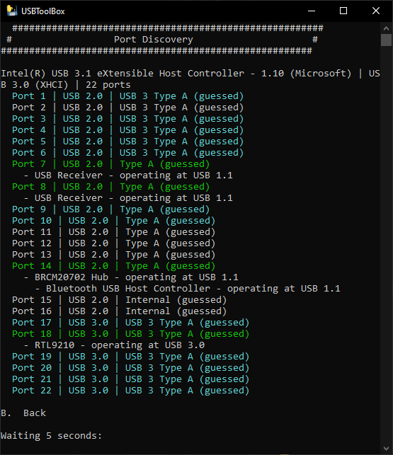
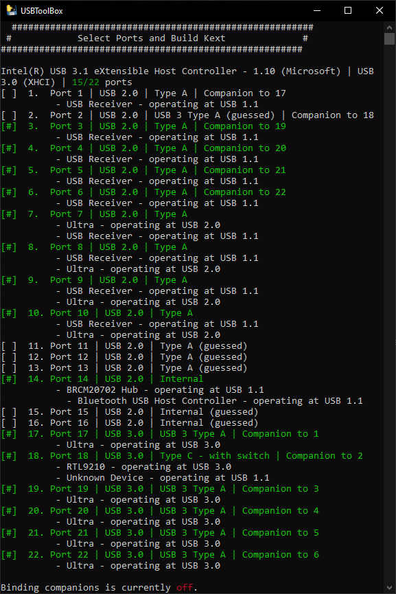
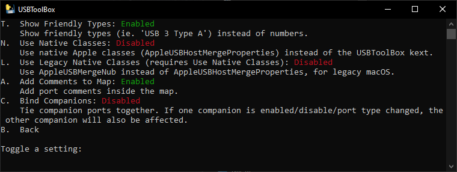
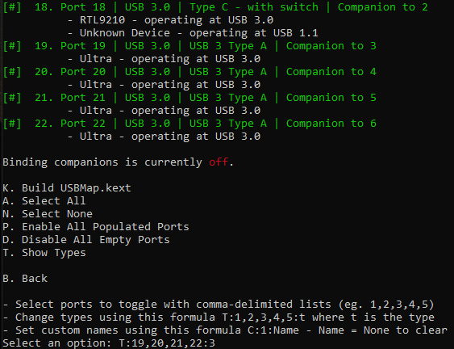

# USB Mapping on Windows

This guide will explain how to do USB mapping on Windows with the excellent [USBToolBox](https://github.com/USBToolBox/tool). If you have Windows already installed on the same system, you can use USBToolbox which is a new terminal based tool that improves upon [USBMap](https://github.com/corpnewt/USBMap) in various ways. It has the technically most advanced solution to USB mapping and it in active development. One advantage of doing this on Windows is the ability to see all ports at once and to map all ports in one go. You can quickly have a ready made port map even before installing macOS.

It also solves some technical issues, such as [removing the need for controller renames in ACPI patches](https://github.com/USBToolBox/kext) and in its default mode does not require the _Model Identifier_ (for example `iMac20,1`) to be specified. This ensures better maintainability. If you do not have Windows installed, you can also utilize USBToolBox on Windows PE by running the free [Hiren's BootCD PE](https://www.hirensbootcd.org) on a USB drive.

### Boot into Windows

Boot into Windows on the computer you want to hackintosh. Windows 10 or 11 (64-bit) are recommended.

Get USBToolbox from [Releases · USBToolBox/tool](https://github.com/USBToolBox/tool/releases) by downloading `Windows.zip` and extracting it.

Launch `USBToolBox/dist/Windows.exe` and you will see the following terminal command window:

 (1).png>)

### Discover Ports

Pressing `"B"` will get you back to the main menu. Then  press `"D"` to discover ports:



Plug in a USB device into each port. _**Wait**_ for the listing to show your USB device before unplugging it and plugging it into another port.

Plug in a USB 2 device and a USB 3 device into each USB 3 port. _(Theoretically you only need to plug in one USB 3 device into the USB 3 ports, because companion detection should be working on Windows, but I still had to use both types of devices.)_

Plug in a USB-C device twice in each applicable port by reversing the direction of the plug.

Once mapping is done, go to the _Select Ports_ screen, by pressing `"S"` in the main menu.

### Select Ports

Select your ports and adjust port types as necessary. The most common types for USB mapping are:

```
USB 2 Type A: 0
USB 3 Type A: 3
USB-C Type C with switch: 9
USB-C Type C without switch: 10
Internal: 255
```



Choose the port numbers which are applicable to you. In this guide I will illustrate the steps by using the port numbers as shown above.

### Deactivate Unused Ports

To toggle the ports `off` that are unused or that you do not want to use, type the port numbers separated by commas

* such as: `1,2,11,12,13,15,16`
* Since I can only use 15 ports I had to drop some. In this example I deactivated the companion USB 2 port of the USB 3.1 port, as well as the USB 2 companion of the USB-C port (number 1 and 2).
* **Note:** Activation and de-activation of ports as well as the definition of physical port types is by default connected to the companion. For example, if you deactivate the USB 2 companion of a USB 3 port both will be deactivated. This may not always be what you want, like in my example, where I just want to deactivate the USB 2 functionality of two USB 3 ports. To decouple these ports you can go into settings to disable _Bind Companions_ first.

#### Adjust Settings (optional)

Press `"C"` (and _"Enter"_) to open and adjust settings.

Change `Bind Companions` to `Disabled` by pressing `"C"` so that you can define related port mappings independently of each other:



###

### Choose Port Types

As soon as you explicitly define the ports, the _"guessed"_ label will disappear.

* For defining the physical USB 2 ports type: `T:7,8,9,10:0`
* For defining the physical USB 3 ports type: `T:3,4,5,6,19,20,21,22:3`



* For defining the physical USB C ports (here _with switch_) type: `T:18:9`
* For defining the internal port type _(without outside user access)_: `T:17:255`

Since the functional USB 2 companion ports _(which are hosted on physical USB 3 ports)_ need to be described by their _physical connector type_, they should be set as USB 3 in the USB mapping.

I also recommend to add comments, for the purpose of long term maintainability. You may need to switch back and forth between the _Select Ports_ screen and the _Port Discovery_ screen after you have been able to determine the physical location of each displayed port.

You should name each port with a clear location _Name_. For this purpose type in a name such as: `C:18:Middle-Left-USB-C` and `C:22:Up-Left-USB3` _(As seen from the direction you are looking at them when the case is upright)_. - If you wish to see the port location names _(saved in the comments of the generated file)_ when you check your ports in macOS, you can use the [_Hackintool_](https://github.com/headkaze/Hackintool) _> USB_ tab and observe where your devices get plugged in.

### Build the Kext

Press `"K"` to build the kext in the `dist` folder:

.PNG>)

The `UTBMap.kext` will also require the companion [USBToolBox.kext ](https://github.com/USBToolBox/kext)to be [downloaded](https://github.com/USBToolBox/kext/releases) and added to your OpenCore EFI. The advantage of utilizing the USBToolBox.kext is among others, that it does not require the _Model Identifier_ to be specified in the USB map. Read the USBToolBox documentation for details.

### Add kexts to OpenCore

Using _OCAuxiliaryTools_ you will now add `USBToolBox.kext` **and** `UTBMap.kext` to your OpenCore `EFI/OC/Kexts` in _Kernel > Add. -_ Remove any other USB related kexts first. _(see_ [_OCAuxiliaryTools Guide_](https://chriswayg.gitbook.io/opencore-visual-beginners-guide/step-by-step/oc-auxiliary-tools)_)_

 (1).png>)

Note: _XhciPortLimit - Enable_ was previously used to patch the XCHI port limit to a higher value than the 15 port maximum. Make sure to check that `XhciPortLimit`in _Kernel > Quirks_ is _**disabled**_! After configuring a proper USB map, it is not needed any more, and since Big Sur 11.3 the `XhciPortLimit` Quirk is not used at all, because it has been causing boot loops for some people.

 (1).png>)

#### Credits

* Thanks to the developer of this excellent tool[ Dhinak G](https://github.com/dhinakg) who also pointed out some issues with the original version of this guide on r/hackintosh.

 _Except where otherwise noted, content on this site is licensed under the_ [_Creative Commons — Attribution-NonCommercial 4.0 International — CC BY-NC 4.0_](https://creativecommons.org/licenses/by-nc/4.0/) _license. Attribution by link to_ [_chriswayg · GitHub_](https://github.com/chriswayg)_._
