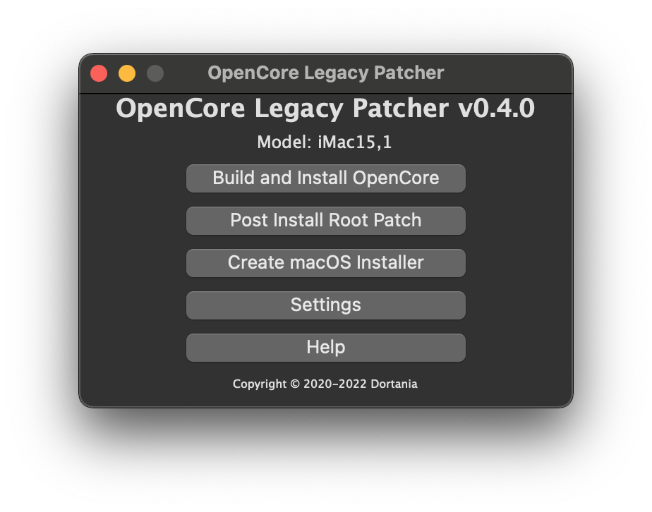
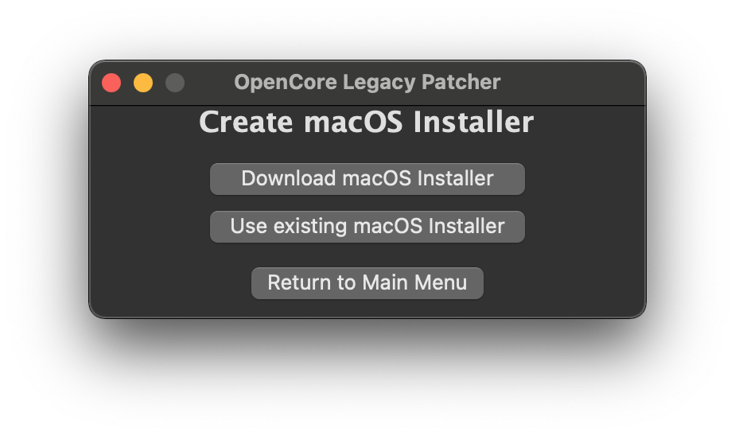
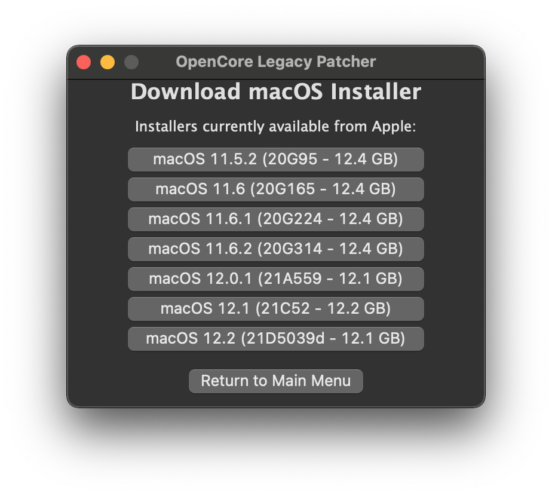
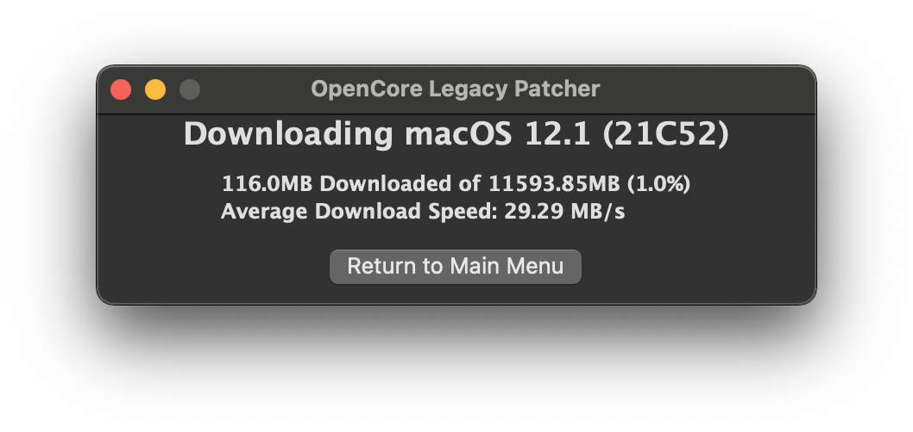
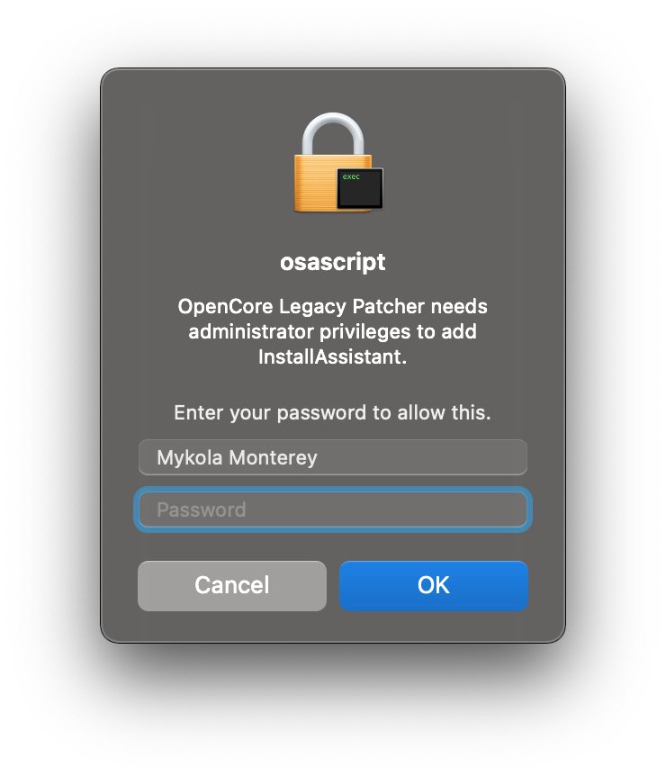
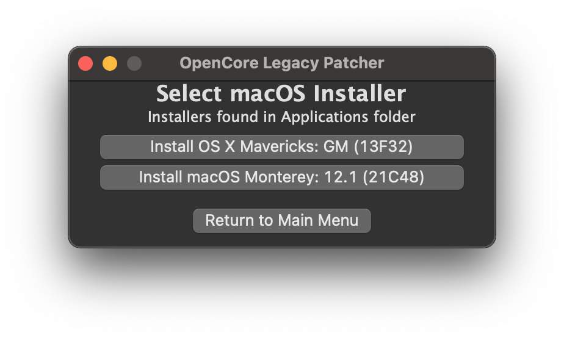
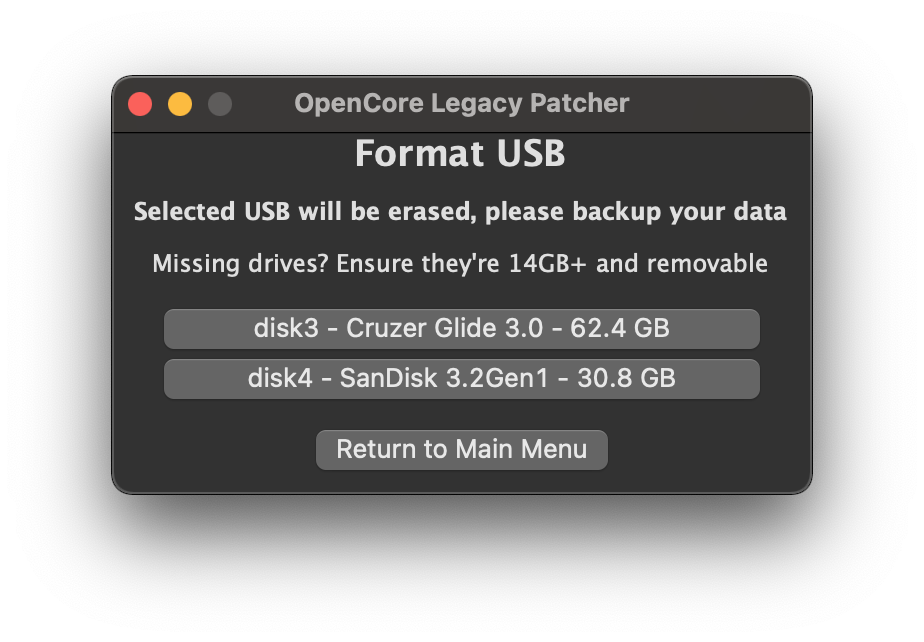

# Create macOS Installer using OCLP

This doc is centered around downloading and writing the macOS installer to a USB drive.

* Note: 16GB+ USB will be required for the installer

### Download and launch OCLP

With _OpenCore Legacy Patcher_ _(OCLP)_, the new GUI includes a convenient download menu for recent macOS installers. We will not be using the other featurs of OCLP, as they are not relevant to creating a hackintosh.

So to start off, you'll want to grab the app:

* [OpenCore Legacy Patcher Release Apps](https://github.com/dortania/OpenCore-Legacy-Patcher/releases)

For this guide, we'll be using the standard **OpenCore-Patcher (GUI)**.

Once downloaded, open the app and you should be greeted with this menu:

### Download macOS Installer

First we'll want to select the _"Create macOS Installer"_ button. This will present you with 2 options:

For this example, we'll assume you'll need an installer. Selecting this option will download Apple's Installer Catalogs and build a list for you to choose:

* **Downloading**

* **Listed Installers**

Since _OCLP only supports Big Sur and newer_, only those entries will be shown. For this example, we'll select macOS 12.1 Monterey as that's the latest public release at the time of writing. This will download and install the macOS installer to your applications folder.

* **Downloading the Installer**

* **Requesting to install**

* **Finished Installing**

### Write installer to USB drive

Once finished, you can proceed to write the installer onto a USB drive.

* Note: The entire USB drive will be formatted
* **Select Downloaded Installer**

* **Select disk to format**

Now OCLP will start the installer flashing - copying macOS to the USB drive!

* **Flashing**

* **Success Prompt**

* **Finished Flashing**

#### Credits

This portion of the guide is almost entirely based on the section [Download and build macOS Installers | OpenCore Legacy Patcher](https://dortania.github.io/OpenCore-Legacy-Patcher/INSTALLER.html#creating-the-installer)
