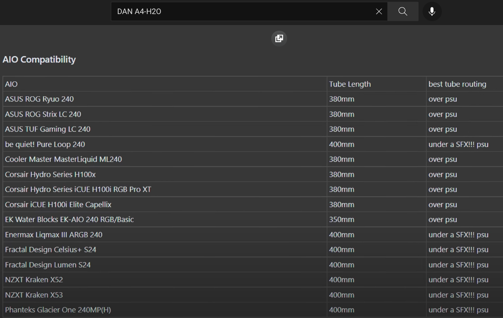

# Hack Studio SFF

**Fun project & benchmark comparison between a US$3,500 SFF Intel** _**Hack Studio**_ **and a US$4,000 M1 Ultra** _**Mac Studio**_.

### Comparison of Specifications

### Mac Studio Ultra US$4,000

[Mac Studio - Technical Specifications - Apple](https://www.apple.com/mac-studio/specs/)

* CPU: M1 Ultra 20-core with 16 performance cores and 4 efficiency cores
* GPU : M1 Ultra 48-core (add US$1,000 for 64 cores)
* Media: H.264, HEVC, ProRes acceleration, 4 engines
* RAM: 64GB unified memory
* SSD: 1TB, up to 7.4GB/s
* WIFI: 802.11ax Wi-Fi 6 & Bluetooth 5.0
* Ethernet: 10Gb
* PORTS: Four Thunderbolt4 ports and 1 HDMI port (5 displays)
* Dual Fan air cooling (All)
* PSU: 370 Watts
* SFF: 4 liter case (20 cm x 20 cm base x 10 cm height)

### Hack Studio Ultra US$3,500

[Hack Studio - Saved Part List - PCPartPicker](https://pcpartpicker.com/user/chriswayg/saved/#view=YvRKqs)

* CPU: i9-12900K - 16-core with 8 performance cores and 8 efficiency cores
* GPU: RX 6900 XT - 40 compute units
* Media: hardware acceleration via RX 6900 XT
* RAM: 64GB DDR 5
* SSD: 1TB, up to 7.0GB/s
* WIFI: 802.11ac & Bluetooth 4.0
* Ethernet: 2.5Gb
* PORTS: 2 Thunderbolt4 Ports, 3x DisplayPort and 1 HDMI port (4 displays)
* Dual Fan liquid cooling (CPU)
* PSU: 850 Watts
* SFF: 11 liter case (14 cm x 32 cm base x 24 cm height)

### Published Benchmarks

These are still limited and lack real world application benchmarks for creative professionals.

#### Geekbench CPU Multi-Core

[Processor Benchmarks - Geekbench Browser](https://browser.geekbench.com/processor-benchmarks)

* i9-12900K - 17201
* **M1 Ultra - 24000** (96% scaling)
* M1 Max- 12500

In raw CPU performance the M1 Ultra is about 50% faster than the i9-12900K, which may not perform optimally in real world applications due to the lack of support for P and E cores in macOS.

#### Geekbench CPU Single-Core

[Processor Benchmarks - Geekbench Browser](https://browser.geekbench.com/processor-benchmarks)

* i9-12900K - 1996
* **M1 Ultra - 1790**
* M1 Max - 1780

#### Geekbench GPU Metal

* [Metal Benchmarks - Geekbench Browser](https://browser.geekbench.com/metal-benchmarks)
* [Geekbench Search - Geekbench Browser](https://browser.geekbench.com/search?k=v5\_compute\&page=3\&q=m1+ultra\&utf8=%E2%9C%93)
* RX 6900 XT - 160187
* M1 Ultra 64 Cores - 104000 (81% scaling)
* RX 6600 XT - 83812
* **M1 Ultra 48 Cores - 91000** (94% scaling)
* M1 Max 32 Cores - 64265

#### Geekbench GPU OpenCl

* [OpenCL Benchmarks - Geekbench Browser](https://browser.geekbench.com/opencl-benchmarks)
* [Geekbench Search - Geekbench Browser](https://browser.geekbench.com/search?k=v5\_compute\&page=3\&q=m1+ultra\&utf8=%E2%9C%93)
* RX 6900 XT - 169247
* M1 Ultra 64 Cores - 86000 (76% scaling)
* RX 6600 XT - 81741
* **M1 Ultra 48 Cores** - **72000** (85% scaling)
* M1 Max 32 Cores - 56550

#### Benchmarks and scaling

The M1 scales almost linearly with doubling the CPU core count from M1 Max to M1 Ultra (96%), but the GPU does not scale quite as well, as the increase in performance is only 80% when doubling the GPU cores. This puts the 48 core version closer to a RX 6600 XT and the 64 core version at only two-thirds of the Metal performance of the RX 6900 XT.

* [Barefeats: M1 Max 16 versus Intel 16](https://barefeats.com/m1-max-16-vs-intel-16.html) The M1 Max does perform better in real world benchmarks than the raw Geekbench Metal scores suggest. With 80% scaling, the M1 Ultra with 64 cores should therefore be able to outperform the RX 6900 XT in some important applications.

### Proposed Alder Lake SFF Hardware for a Hack Studio Ultra

[Hack Studio Ultra - PCPartPicker](https://pcpartpicker.com/user/chriswayg/saved/#view=YvRKqs) US$3,500

See also: [Hack Studio Max - PCPartPicker](https://pcpartpicker.com/user/chriswayg/saved/#view=rhvjnQ) US$1,800

* **MB: Z690 miniITX**
  * [ROG STRIX Z690-I GAMING WIFI mini ITX DDR5](https://rog.asus.com/motherboards/rog-strix/rog-strix-z690-i-gaming-wifi-model/)
* **CPU: i9-12900K**
  * [Intel Core i912900K Processor 30M Cache up to 5.20 GHz](https://ark.intel.com/content/www/us/en/ark/products/134599/intel-core-i912900k-processor-30m-cache-up-to-5-20-ghz.html)
* **GPU: RX 6900 XT**
  * [Sapphire NITRO+ AMD Radeon RX 6900 XT 16G GDDR6](https://www.sapphiretech.com/en/consumer/nitro-radeon-rx-6900-xt-16g-gddr6) 310x55mm
* **RAM: 64 GB DDR 5**
  * [Crucial 64GB Kit (2 x 32GB) DDR5-4800 | Crucial.com](https://www.crucial.com/memory/ddr5/ct2k32g48c40u5)
* **SSD: 1TB -** Read 7000MB/s & Write 5300MB/s
  * [WD BLACK SN850 NVMe SSD PCIe Gen4 | Western Digital](https://www.westerndigital.com/products/internal-drives/wd-black-sn850-nvme-ssd#WDS100T1X0E)
* **Wifi Fenvi**
  * [1200Mbps Hackintosh MacOS BCM94360NG M.2 Wifi Card Bluetooth 4.0 - AliExpress](https://www.aliexpress.com/item/32704591968.html)
* **Liquid Cooler** - 240 mm
  * [Corsair - iCUE H100i ELITE CAPELLIX Liquid CPU Cooler](https://www.corsair.com/us/en/Categories/Products/Liquid-Cooling/iCUE-ELITE-CAPELLIX-Liquid-CPU-Cooler/p/CW-9060046-WW)
* **PSU: 850 W**
  * [V850 SFX Gold 850W Full-Modular 80 Plus | Cooler Master](https://www.coolermaster.com/catalog/power-supplies/v-series/v850-sfx-gold/)
* **Case: 11 liter SFF**
  * [Lian Li x DAN A4-H20](https://lian-li.com/product/a4h2o/), [Review | TechPowerUp](https://www.techpowerup.com/review/lian-li-x-dan-a4-h2o/), [Review | Optimum Tech](https://www.youtube.com/watch?v=K3S5y\_uaFKQ)

#### Liquid Cooler in SFF Case

* hoses should face upward and pump should not be too big pump due to cramped ITX board
* use shorter hoses (380 mm, over PSU), rather than over memory and under PSU

An i7-12700 might be more suitable for this case with a 240 mm cooler. - If the cooling capacity inside the Lian Li DAN A4-H20 proves to be insufficient for the i9-12900K, a case like the 15 liter [Meshlicious](https://www.ssupd.co/products/meshlicious?variant=39809164214456) could be used instead, as it can accommodate a bigger 280 mm liquid cooler and has more space for the GPU. _(Dimensions:42 cm x 22 cm x 31 cm)_

### Updated Benchmarks

More real world benchmarks as they become available:

* [M1 Ultra vs Intel & NVIDIA - Did Apple FAKE Performance?](https://www.youtube.com/watch?v=hQqtYqT-Me8)
* [$4,000 M1 Ultra 48 Core Mac Studio: IN DEPTH Benchmark and Testing](https://www.youtube.com/watch?v=ZHSij9WREC4)

 _Except where otherwise noted, content on this site is licensed under the_ [_Creative Commons — Attribution-NonCommercial 4.0 International — CC BY-NC 4.0_](https://creativecommons.org/licenses/by-nc/4.0/) _license. Attribution by link to_ [_chriswayg · GitHub_](https://github.com/chriswayg)_._
