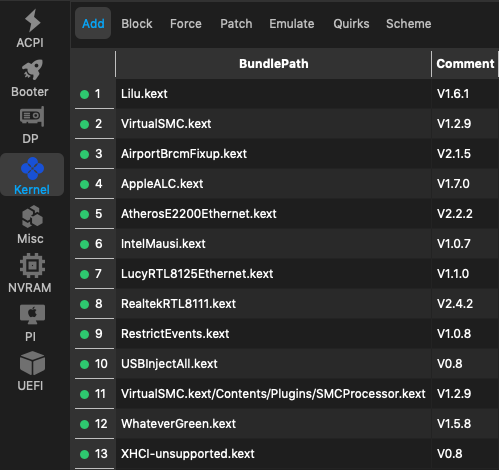
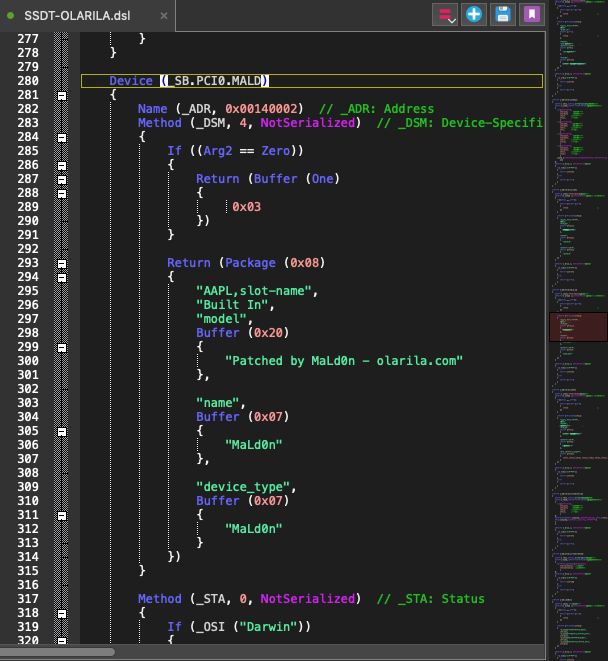

# Olarila - Not Recommended

## Olarila - a commercialized BlackBox distro with unmaintainable SSDT/DSDT

I still see far too many people recommending Olarila. _**Let me explain why I think using any of Olarila's preconfigured distros or EFIs is a bad idea.**_ It's not just because the distro with the included tools could theoretically contain malware.

_It's mainly because Olarila will try to draw you into their commercialized ecosystem and make you dependant on their hard to maintain configuration!_ - How do they do that? If you download any of their preconfigured OpenCore EFIs and analyze them you will notice a pattern which we have observed with the Clover based _Beast_ tools in the past as well: far too many quirks are enabled, far too many kexts are loaded and enabled, unnecessary boot arguments and drivers are added. All this makes troubleshooting and maintenance much harder, even though it might provide inexperienced newcomers more likelihood of an initial install success.

The distinguishing mark of the _Olarila_ method though, is their huge, all-in-one SSDT or DSDT. For example, in the preconfigured, undocumented Coffee Lake `SSDT-OLARILA.aml` there are hundreds of lines of code additional to what is found in the four well documented SSDTs which are recommended by the [Desktop Coffee Lake | Dortania OpenCore Install Guide](https://dortania.github.io/OpenCore-Install-Guide/config.plist/coffee-lake.html#acpi). Additionally the modular approach of the Dortania guide is far superior with regards to troubleshooting and maintenance, than a huge blob of code in one bin binary file which is barely documented when disassembled.

**How do they commercialize their methodology?** By bombarding every user with recommendations for US$30 or US$50 donations for gaining specialized support and individualized DSDT editing, which can only be done by very few highly experienced people, like the main Olarila admin:

> **50$** = Premium User with Personal room, support, _**DSDT edits**_, support with Telegram or WhatsApp, unlimited upload with 20mb per file.

They do not freely share knowledge and enable skills in the way we do on r/hackintosh. There are hundreds and hundreds of posts and comments showing their _eight donation payment methods_ in huge letters. Once people get hooked into their setup and methodology, many will end up paying, because they do not understand anything about their configuration, and cannot get some important things to work. Most do not even realize that this is the way the whole Olarila system has been set up: initially provide free videos, tutorials, EFIs and distros, but with undocumented complex parts (SSDT/DSDT) that are a BlackBox to most and are almost impossible to maintain throughout upgrades and hardware changes by the users.

The mod team on r/hackintosh has already given the reasons why using distros are not recommended and why using the [OpenCore Install Guide](https://dortania.github.io/OpenCore-Install-Guide/) is the only supported approach here, with more explanations in the [ModPost r/Hackintosh rules clarifications](https://www.reddit.com/r/hackintosh/comments/slhprk/modpost\_rhackintosh\_rules\_clarifications\_and\_more/).

> The reason for this is that these tools do more damage than good as they neither teach you what you're doing and can also damage macOS itself with unneeded framework changes.

I stumbled across the Olarila stuff as I was researching Alder Lake. I initially did not even visit the Olarila site, but the previously excellent _InsanelyMac,_ which is strangely still recommended by Dortania. InsanelyMac is being flooded with Olarila OpenCore _'guides',_ which all require a custom _'Full DSDT Patched'_ in order to work. For example: _\[Guide] Catalina / BigSur / Monterey on mobos Serie 100 / 200 / 300 / 400 / 500 / 600 SkyLake / KabyLake / CoffeeLake / CometLake / RocketLake / AlderLake DSDT._

There will probably be some staunch defenders of Olarila. Please document and prove your claims with links, if you disagree with my evaluation. You are free to continue to use Olarila as much as you like and to get support within the original community. Olarila apparently warns against us with these words: _"We do not support sites like Reddit, TonyMac, Youtube Channels and others. These sites have a bunch of non-sense things and is not good to one Real Vanilla Hackintosh"._ Since we are the biggest hackintosh site on Reddit, they appear to accuse us of what they are guilty of: "a bunch of non-sense things and is not good".

If you have used Olarila to get started, that's all right to get a taste of hackintoshing, but it's better to use a method which empowers you rather than a method that makes you dependant. OpenCore with the excellent Dortania guides may have a learning curve, but its worth the effort, if you want to really be able to maintain your hackintosh for the next few years. Many on  [r/hackintosh](https://www.reddit.com/r/hackintos) also provide plenty of help and support with additional guides, related tools, and by sharing their skills. You are very welcome to learn there!

_Note: I have purposely avoided directly linking to the site, as I do not want to encourage people to unnecessarily visit there. Nevertheless all the quotes are real as of Feb. 23, 2022 and the screenshots are from files I personally checked._

## Additional warnings by users

u/mohdismailmatasin wrote: _"Why I don't need "Olarila"? I found the answer when reading some articles related to "DSDT" injections. I argue on several grounds. Each "Boot Loader" plays an important role in reading the ACPI found in a computer. We can only make additions and a few small changes._

_However, changes or additions can only be made to the SSDT. Why not "DSDT"? Because "DSDT" is the main table in computer features. "SSDT" is only an additional or secondary feature that provides device information to an Operating System. "OpenCore" acts wisely by giving a recommendation that injections can be done only on SSDT and DeviceProperties in config.plist._

_Why are injections or patches not suitable for "DSDT"? - Since it is the main table, patch errors can cause "UEFI" or "BIOS" to fail and need to be reset. Since most "Boot Loaders" like "Clover" and "OpenCore" read the ".aml" file, you need to remember that the bootloader feature reads the DSDT of your machine. When a patch is performed on a DSDT, the Boot Loader" read the "patched DSDT" twice in different command forms. This situation can be monitored through the "OpenCore" EFI Debug Log. "Modding DSDT" may cause the boot process to slow down, as well as there is a possibility of damaging your motherboard instruction map. The concept described by "Olarila" is very dangerous to newcomers._

_... If you notice, Olarila recommend users to use **"RunMe.app"**. Indirectly you share all the information regarding hardware, serial number, uuid, and even ioreg. While it's just a hackintosh machine, we need to make sure our privacy is more important than the hackintosh issues. Therefore, reading and understand is important before doing something."_

 _Except where otherwise noted, content on this site is licensed under the_ [_Creative Commons — Attribution-NonCommercial 4.0 International — CC BY-NC 4.0_](https://creativecommons.org/licenses/by-nc/4.0/) _license. Attribution by link to_ [_chriswayg · GitHub_](https://github.com/chriswayg)_._
