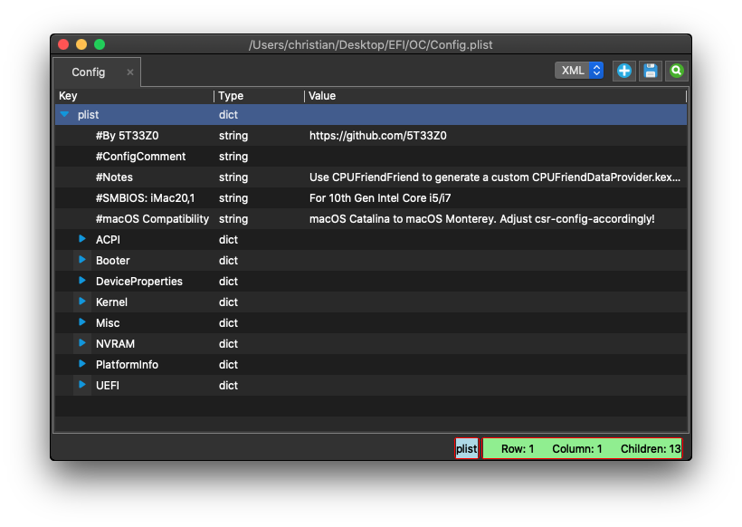

# Install & Postinstall

## Install

- Enable the BIOS settings optimal for macOS: [Intel BIOS settings](https://dortania.github.io/OpenCore-Install-Guide/config.plist/comet-lake.html#intel-bios-settings)
- Follow the [Installation Process](https://dortania.github.io/OpenCore-Install-Guide/installation/installation-process.html#installation-process) from the OpenCore Install Guide

## Post Install

- Follow [OpenCore Post-Install](https://dortania.github.io/OpenCore-Post-Install/)
- *Hackintool* can be used for  [USB-Mapping](https://dortania.github.io/OpenCore-Post-Install/usb/) as a GUI alternative to *USBMap*
- Debug settings should be changed after everything works.

## Related GUI tools

### PlistEDPlus

* [PlistEDPlus](https://github.com/ic005k/PlistEDPlus) a lightweight plist editor with rich features.

### Hackintool

* [Hackintool](https://github.com/headkaze/Hackintool) completely supports vanilla installs, is open source and is popular in the German hackintosh community.

* useful for system information, iGPU configuration and USB mapping:

## Versions used

This guide was written in January 2022 and tested with the current release versions of each tool. Even though the basic steps will remain the same, some details will change during subsequent updates of *OpenCore*, *OCAuxiliaryTools* and *TINU*. Always check the most recent version of the [OpenCore Install Guide](https://dortania.github.io/OpenCore-Install-Guide/) and verify that OCAuxiliaryTools is supporting the latest version of OpenCore.

- OpenCore 0.7.7

- OCAuxiliaryTools 20220110 for OpenCore 0.7.7

- TINU 3.0.1
