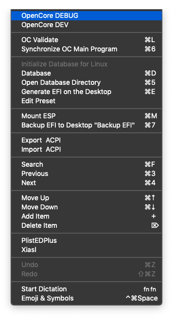
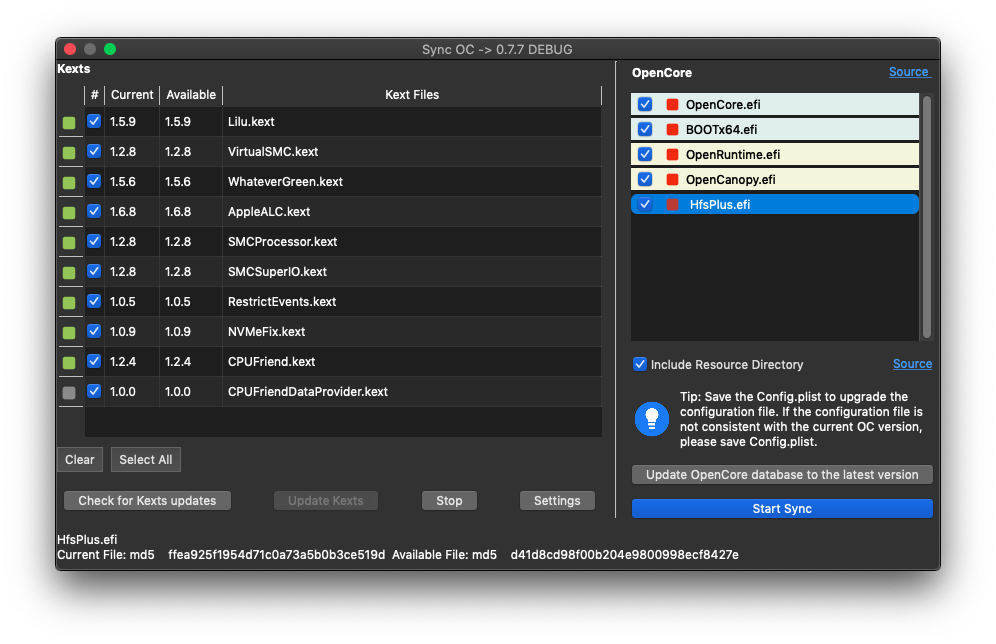
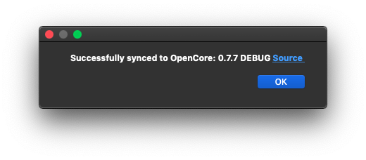
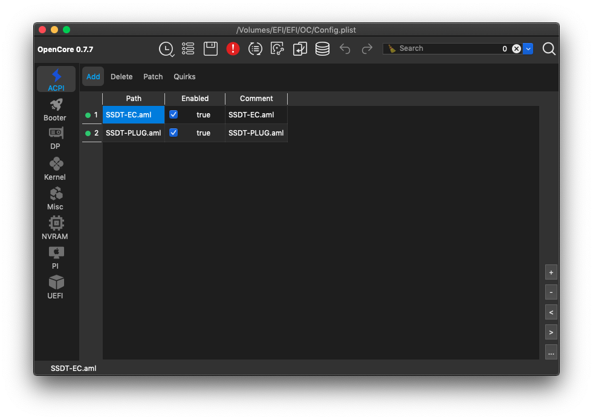
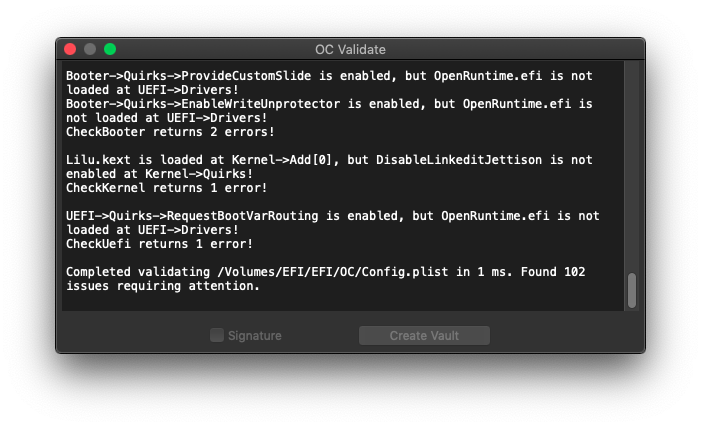
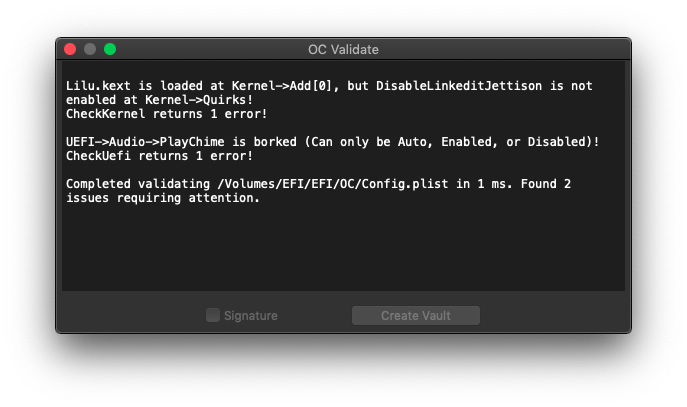
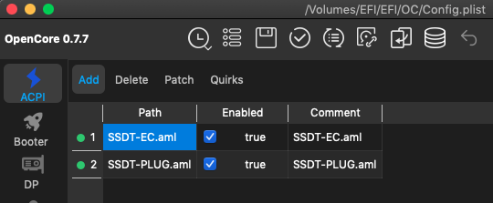
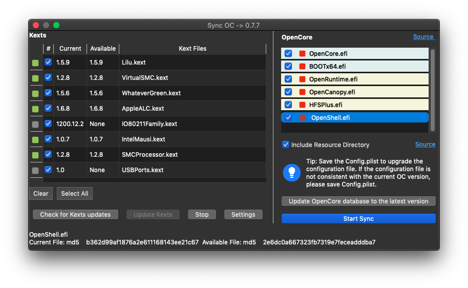
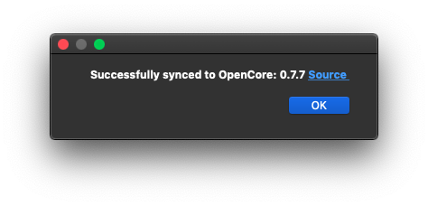

# Debug and Upgrade OpenCore with OCAuxiliaryTools

## Switch to the Debug Version of OpenCore

- Launch OCAuxiliaryTools and open the relevant Config.plist.

- If you encounter problems during booting, you should utilize the *debug* version of OpenCore. As explained previously in the *Misc* section, make sure you have activated debugging and then *Select Menu -> Edit -> OpenCore DEBUG*

- Next, select *Menu -> Edit -> Synchronize OC Main Programn* or click the *Sync OC main program* button.

- Then press the *Start Sync* button.

- Once everything works you can switch back to the *release* version by taking essentially the same steps:
  
  - Select *Menu -> Edit -> OpenCore DEBUG* - This will uncheck *OpenCore DEBUG* in the Menu.
  
  - Select *Menu -> Edit -> Synchronize OC Main Programn* or click the *Sync OC main program* button.
  
  - Press the *Start Sync* button.

## Upgrade OpenCore and Kexts 

Currently, the easiest method to keep your OpenCore files, drivers, config and kexts up to date is to use OCAuxiliaryTools. 

### Updating the Config.plist

OCAuxiliaryTools actually merges any changes made to the structure of the Config.plist and feature-set, thereby updating it to the latest version, without losing settings. It integrates the tasks which had to be handled manually by four separate tools in the past such as *OCConfigCompare*, *KextUpdater*, *ProperTree* and *OCValidate*.

- Mount your EFI partition: *Menu -> Edit -> Mount ESP Partition*
- Then click *Mount and open Config.plist*

It is recommended to perform the upgrade first on a USB-stick and then transfer the EFI, after you are sure that the upgrade was successful. In any case backup your EFI first before making any changes.

- Select *Menu -> Edit -> Backup EFI to Desktop* or click the *Backup EFI to Desktop* button.

- Select *Menu -> Edit -> Sync OC Main Program*. -  If your Config.plist is outdated, you should see some OC Validate warnings indicated by a red exclamation mark on the OC Validate button.

- Clicking on the red button will show the errors. 

- Close the *OC Validate* dialog. Because the *Save* button is grayed out, make and reverse a change by (for example) clicking twice on *ACPI -> Quirks -> NormalizeHeaders*  so that the *Save* button will turn blue. Now click the *Save* button, which will update the Config.plist and get rid of all or most of the shown errors. 

- Correct any remaining erros as indicated by OC Validate. The OC Validate button will change from red into a checkmark. This should be sufficient for updating your Config.plist.

  
- Note: Any additional errors are most likely configuration errors which you need to fix on your own. Also refer to [Updating OpenCore and macOS | OpenCore Post-Install](https://dortania.github.io/OpenCore-Post-Install/universal/update.html) in the Dortania guide, which provides more details.
  
### Upgrading Kexts

Ocasionally you may need to remove a kext (or driver) which is not needed any more for the newest version of OpenCore or which has been replaced with another. Deleting kexts in the *Kernel -> Add* section will remove them from the Config.plist, but not from the disk. Since *OCAuxiliaryTools* automatically syncs changes on disk with the kext list in Config.plist, it is easier to just delete them from the disk. From the *Kernel - Add* section select *Menu -> File -> Browse* to show your current kexts in the Finder. Then delete any outdated kext.

- Next, select *Menu -> Edit -> Synchronize OC Main Programn* or click the *Sync OC main program* button.

- In this dialog window we see Kexts on the left and OpenCore files on the right with indicators which files will need to be updated: Green = up-to-date, Red = outdated, Gray = link to repo is missing.  You can add a repo link for kexts in *Settings -> Kext Update URL -> [+]*.

- We will start with the kexts. Therefore, click *Select All* or individually mark the checkboxes for kexts you want to update (otherwise they will be ignored).

- Click on *Check for Kexts Updates*. This will download the latest available kexts. 

- Click on *Update Kexts*, which will update the kexts in your EFI folder.

### Upgrading OpenCore, Drivers and Resources

- On the right side of the above shown dialog window, the relevant files to be upgraded should already be selected automatically in the OpenCore file table 
- Click *Update OpenCore to the latest version*. This is optional for the current stable version of OpenCore, but is recommended if you are using the OpenCore DEV version.
- Then press the *Start Sync* button.

- If you check back in the *Sync* window, all OpenCore files should now be marked green.

  
  
### NOTES

- If you are updating from OpenCore ≤ 0.6.5: disabling `Bootstrap` is required prior to updating OpenCore, to avoid an issue which otherwise can only be resolved by a CMOS reset. Follow the steps outlined here: [Updating Bootstrap | OpenCore Post-Install](https://dortania.github.io/OpenCore-Post-Install/multiboot/bootstrap.html#updating-bootstrap-in-0-6-6)

- If you are updating from OpenCore ≤ 0.7.2, you need to set UEFI -> APFS -> `MinDate` and `MinVersion` to `-1` if you are using macOS Catalina or older.

- Much of the *Upgrade OpenCore and Kexts* portion of this guide is based on [Updating OpenCore and Kexts with OCAT](https://github.com/5T33Z0/OC-Little-Translated/blob/main/D_Updating_OpenCore/README.md)  by 5T33Z0. Also check his helpful [OpenCore Config Tips and Tricks](https://github.com/5T33Z0/OC-Little-Translated/tree/main/A_Config_Tips_and_Tricks) and other sections in his repo.
