# Create macOS Installer - OCLP

## Create a bootable installer for macOS with OCLP

This section of the guide is focused around downloading and writing the full macOS installer to a USB drive and then copying the EFI folder to the USB drive as well to create a bootable installer.

* Note: 16GB+ USB will be required for the installer

_OLCP will only be able to create an installer for Big Sur or newer. If you need to create an installer for macOS Catalina or older, then use this alternative method:_ [_Create a bootable installer for macOS with TINU_](../alternatives/create-installer-using-tinu.md)_._

### Download and launch OCLP

With _OpenCore Legacy Patcher_ _(OCLP)_, the new GUI includes a convenient download menu for recent macOS installers. We will not be using the other features of OCLP, as they are not relevant to creating a hackintosh.

So to start off, you'll want to grab the latest _OpenCore-Patcher-GUI.app.zip_ from:

* [OpenCore Legacy Patcher Release Apps](https://github.com/dortania/OpenCore-Legacy-Patcher/releases/latest)

For this guide, we'll be using the standard **OpenCore-Patcher (GUI)**. Once downloaded, open the app and you should be greeted with this menu:

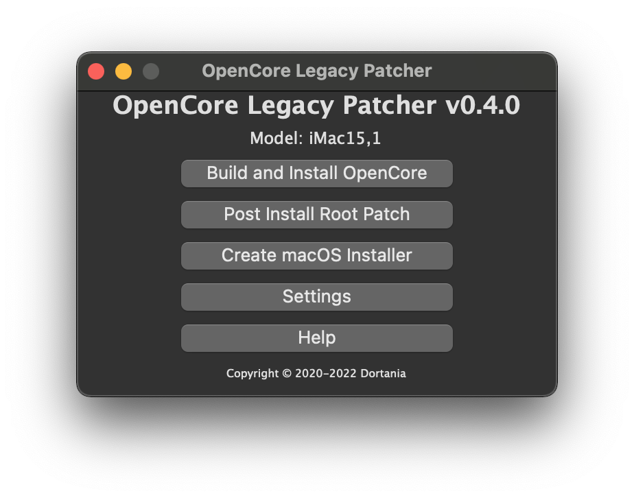

### Download macOS Installer

First we'll want to select the _"Create macOS Installer"_ button. This will present you with 2 options:

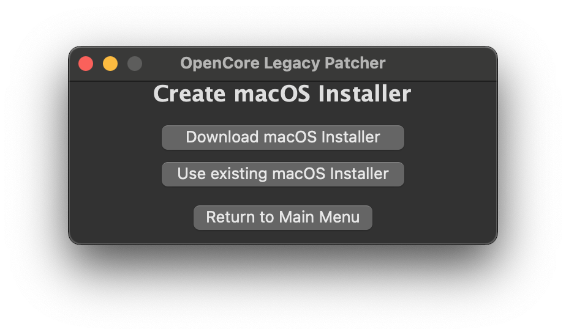

For this example, we'll assume you'll need an installer. Selecting this option will download Apple's Installer Catalogs and build a list for you to choose:

* **Downloading**

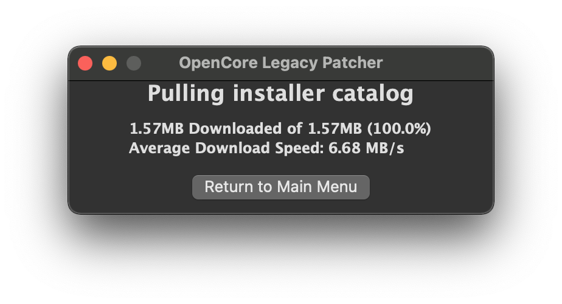

* **Listed Installers**

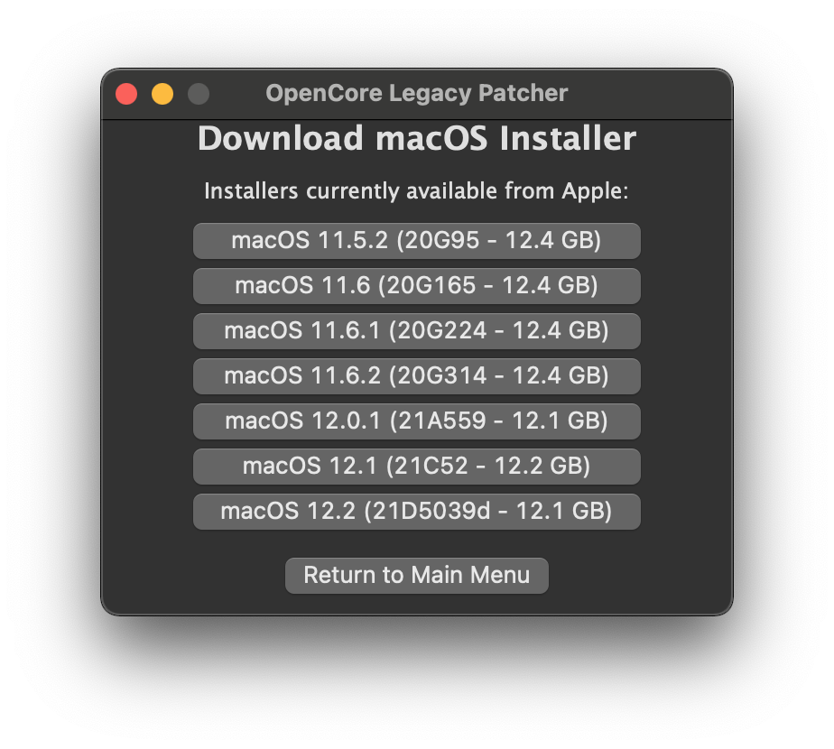

Since _OCLP only supports Big Sur and newer_, only those entries will be shown. For this example, we'll select macOS 12.1 Monterey. This will download and save the macOS installer to your _Applications_ folder.

* **Downloading the Installer**

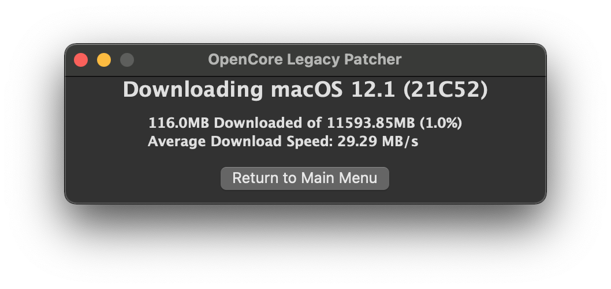

* **Requesting to install**

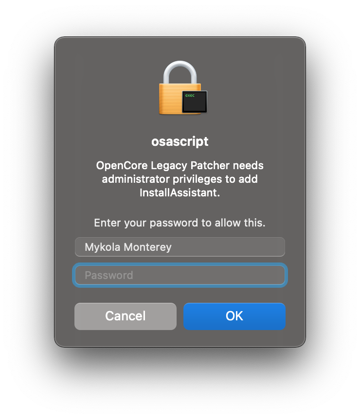

* **Finished Installing**

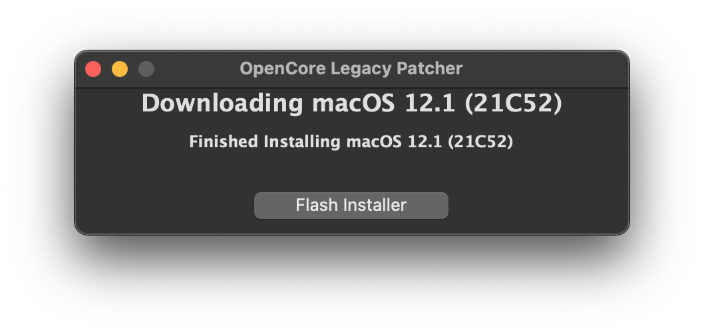

### Write installer to USB drive

Once finished, you can proceed to write the installer onto a USB drive.

* Note: The entire USB drive will be formatted
* **Select Downloaded Installer**

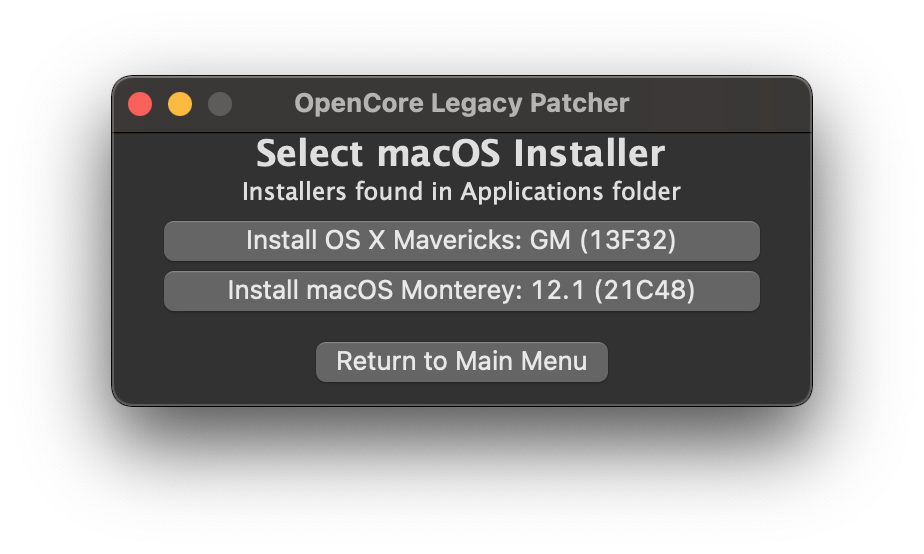

* **Select disk to format**

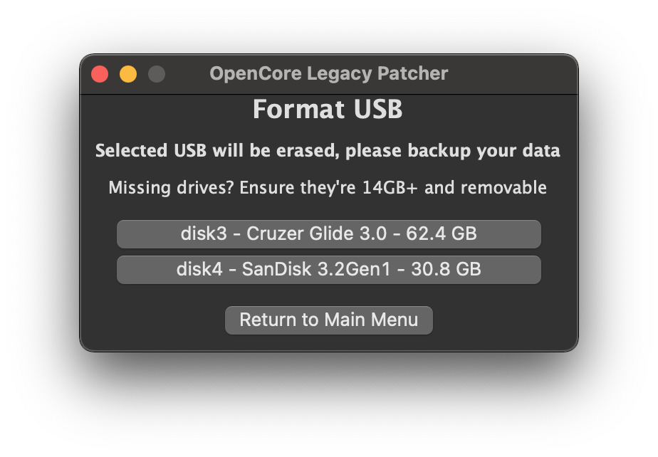

Now OCLP will start the installer flashing - copying macOS to the USB drive!

* **Flashing**

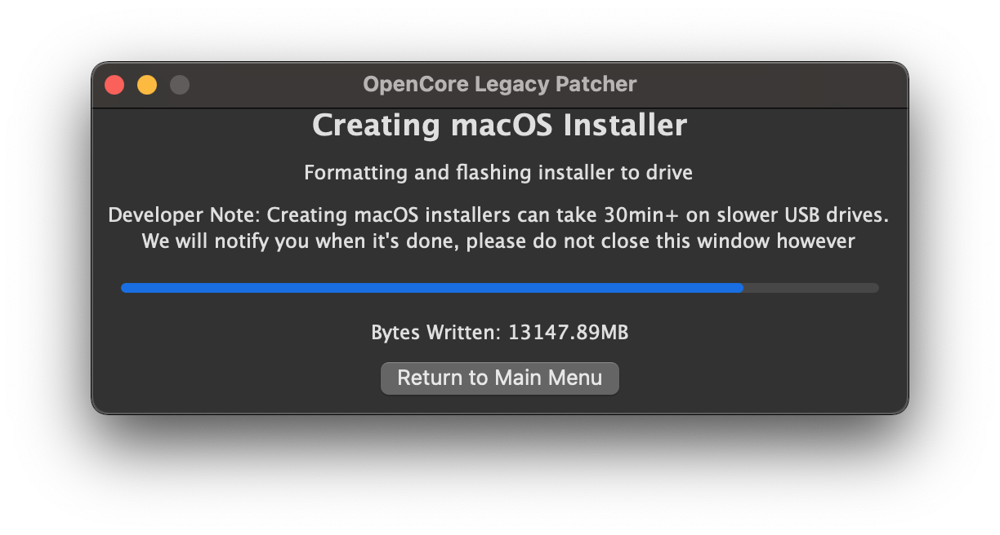

* **Success Prompt**

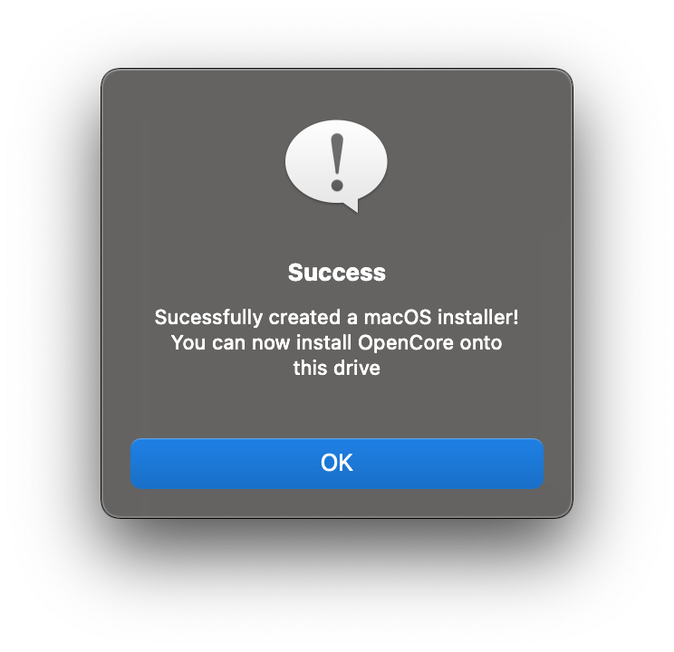

* **Finished Flashing**

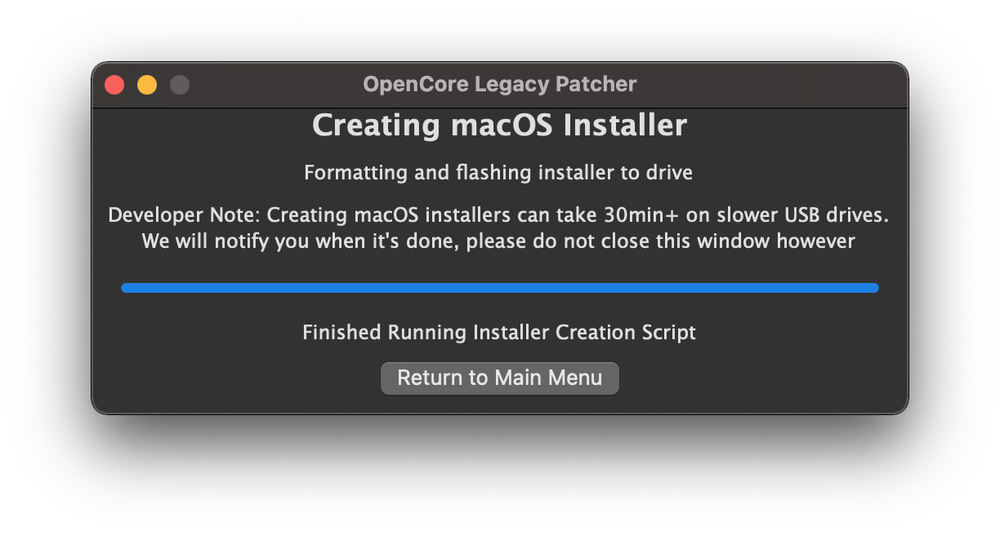

* You may now exit the OCLP App.

### Copy EFI folder to USB drive

* Downlaod, install and launch [EFI-Agent](https://github.com/headkaze/EFI-Agent/releases)
* Open _EFI Agent_ from its Menu Bar Icon and click on the downward triangle next to the USB drive you wish to use (_SanDisk Ultra_ in this example).

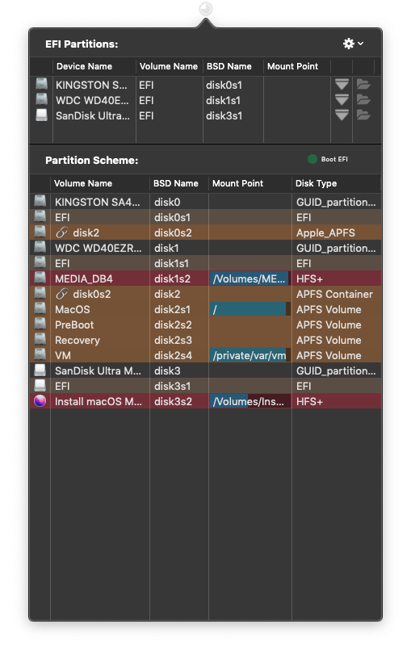

* After authenticating, you will see the EFI partition of your USB drive in the Finder.

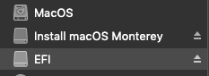

* Drag to copy the EFI folder previously created and configured with [OCAuxiliaryTools](https://chriswayg.gitbook.io/opencore-visual-beginners-guide/oc\_auxiliary\_tools) from the **Desktop** to the EFI partition on the USB drive.

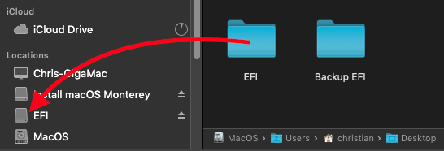

This step completes the creation of a hackintosh bootable USB drive with the macOS installer and the OpenCore EFI folder on it. - You may want to add some tools such as _OCAuxiliaryTools_ and _EFI-Agent_ to the USB drive, as these will be useful during post-install configuration.

#### Credits

_This portion of the guide is mostly based on the section_ [_Download and build macOS Installers | OpenCore Legacy Patcher_](https://dortania.github.io/OpenCore-Legacy-Patcher/INSTALLER.html#creating-the-installer) _by Dortania._
