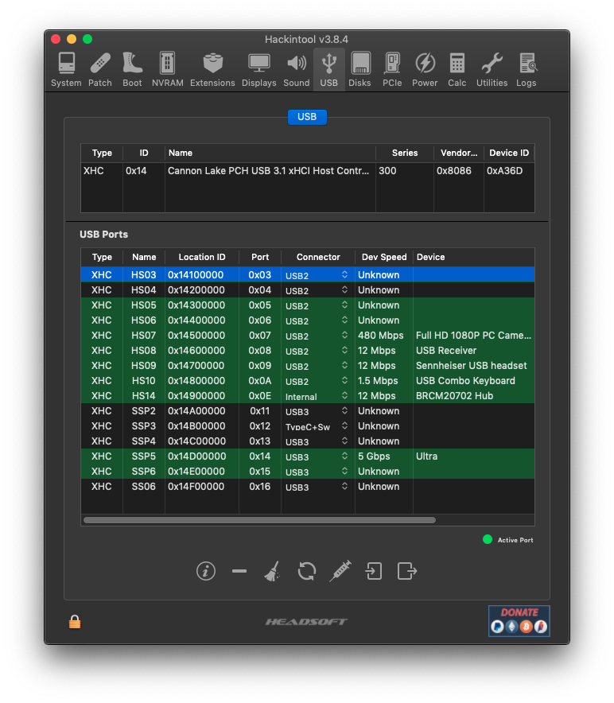

# Install & Postinstall

## Install

* Enable the BIOS settings optimal for macOS: [Intel BIOS settings](https://dortania.github.io/OpenCore-Install-Guide/config.plist/comet-lake.html#intel-bios-settings)
* Follow the [Installation Process](https://dortania.github.io/OpenCore-Install-Guide/installation/installation-process.html#installation-process) from the OpenCore Install Guide

## Post Install

* Follow [OpenCore Post-Install](https://dortania.github.io/OpenCore-Post-Install/)
* With the new _USBToolbox_, USB Mapping has become easier, but it should be done on Windows. Follow the Guide for [USB Mapping](usb-mapping.md). _(With this method there is no more need for_ [_USBInjectAll.kext_](https://dortania.github.io/OpenCore-Post-Install/usb/system-preparation.html#system-preparation) _or checking for_ [_ACPI renames_](https://dortania.github.io/OpenCore-Post-Install/usb/system-preparation.html#checking-what-renames-you-need)_.)_
* If USB mapping on macOS is preferred _Hackintool_ could also be used as a GUI alternative to [_USBMap_](https://dortania.github.io/OpenCore-Post-Install/usb/intel-mapping/intel.html), but mapping on macOS has become more difficult since Big Sur.
* After everything works, debug settings should be changed back to normal.

## Related GUI tools

### PlistEDPlus

* [PlistEDPlus](https://github.com/ic005k/PlistEDPlus) a lightweight plist editor with rich features.

### Hackintool

* [Hackintool](https://github.com/headkaze/Hackintool) completely supports vanilla installs, is open source and is popular in the German hackintosh community.
* useful for system information, iGPU configuration and USB mapping:

## Versions used

This guide was written in January 2022 and tested with the current release versions of each tool. Even though the basic steps will remain the same, some details will change during subsequent updates of _OpenCore_, _OCAuxiliaryTools_ and _TINU_. Always check the most recent version of the [OpenCore Install Guide](https://dortania.github.io/OpenCore-Install-Guide/) and verify that OCAuxiliaryTools is supporting the latest version of OpenCore.

* OpenCore 0.7.7
* OCAuxiliaryTools 20220110 for OpenCore 0.7.7
* TINU 3.0.1
