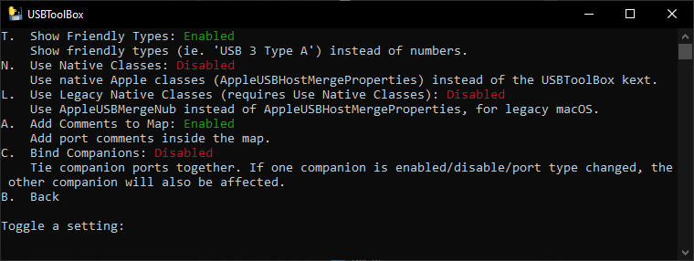
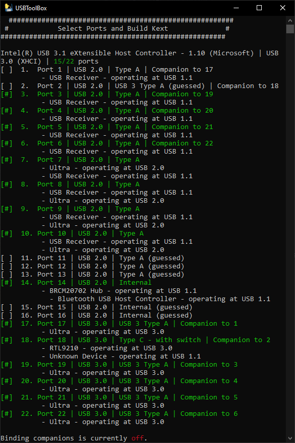
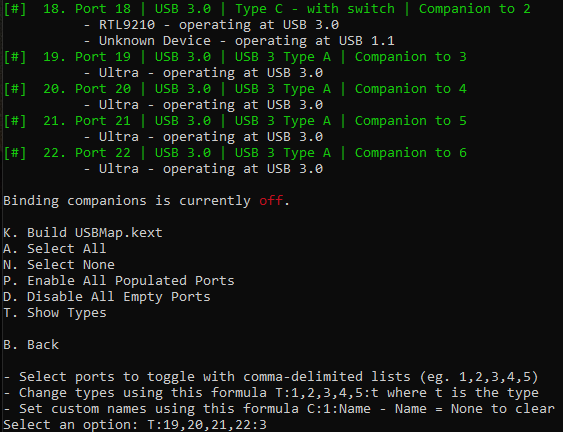

# USB Mapping

Currently USB Mapping is difficult to do on macOS. Therefore this guide will explain how to do USB mapping on Windows with the excellent USBToolbox.&#x20;

Boot into Windows on the computer you want to hackintosh. Windows 10 or 11 (64-bit) are recommended.&#x20;

Get USBToolbox from [Releases · USBToolBox/tool](https://github.com/USBToolBox/tool/releases) by downloading `Windows.zip` and extracting it.

Launch `USBToolBox/dist/Windows.exe` and you will see the following terminal command window:

.png>)

#### Adjust Settings

Press `"C"` (and _"Enter"_) to open and adjust settings.

Change `Bind Companions` to `Disabled` by pressing `"C"` so that you can define related port mappings independently of each other:



#### Discover Ports

Pressing `"B"` will get you back to the main menu. Then  press `"D"` to discover ports:


Plug in a USB device into each port. Wait for the listing to show your USB device before unplugging it and plugging it into another port.

Plug in a USB 2 device and a USB 3 device into each USB 3 port. _(Theoretically you only need to plug in one device to USB 3 ports as companion detection should be working on Windows.)_

Plug in a USB-C device twice by reversing the direction of the plug.

Once mapping is done, go to the Select Ports screen, by pressing `"S"` in the main menu.

#### Select Ports

Select your ports and adjust port types as necessary. The most common types for USB mapping are:

```
USB 2 Type A: 0
USB 3 Type A: 3
USB-C Type C with switch: 9
USB-C Type C without switch: 10
Internal: 255
```



Choose the port numbers which are applicable to you. In this guide I will illustrate the steps by using the port numbers as shown above.

#### Deactivate Unused Ports

To toggle the ports `off` that are unused or that you do not want to use, type the port numbers separated by commas&#x20;

* such as: `1,2,11,12,13,15,16`&#x20;
* Since I can only use 15 ports I had to drop some. In this example I deactivated the companion USB 2 port of the USB 3.1 port, as well as of the USB-C port (number 1 and 2).

#### Choose Port Types

As soon as you explicitly define the ports, the _"guessed"_ label will disappear.

* For defining the USB 2 ports type: `T:3,4,5,6,7,8,9,10:0`
* For defining the USB 3 ports type: `T:19,20,21,22:3`



* For defining the USB C ports (here _with switch_) type: `T:18:9`
* For defining the internal port type: `T:17:255`

#### Build the Kext

Press `"K"` to build the kext in the `dist` folder


The `UTBMap.kext` will also require the companion [USBToolBox.kext ](https://github.com/USBToolBox/kext)to be [downloaded](https://github.com/USBToolBox/kext/releases) and added to your OpenCore EFI. The advantage of utilizing the USBToolBox.kext is among others, that it does not require the model identifier to be specified in the USB map. Read the USBToolBox documentation for details.

#### Add kexts to OpenCore

Using _OCAuxiliaryTools_ you will now add `USBToolBox.kext` **and** `UTBMap.kext` to your OpenCore `EFI/OC/Kexts`. Remove any other USB related kexts first.&#x20;

_`XhciPortLimit - Enable`_ was previously used to patch the XCHI port limit to a higher value. Make sure to check that `XhciPortLimit`in Kernel > Quirks is _**disabled**_! After configuring a proper USB map, it is not needed any more, and since Big Sur 11.3 the `XhciPortLimit` Quirk is not used at all, because it has been causing crashes. __&#x20;
