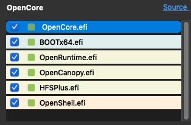

# Upgrade OpenCore

## Upgrade OpenCore and Kexts

Currently, the easiest method to keep your OpenCore files, drivers, config and kexts up to date is to use OCAuxiliaryTools.

### Updating the Config.plist

OCAuxiliaryTools actually merges any changes made to the structure of the Config.plist and feature-set, thereby updating it to the latest version, without losing settings. It integrates the tasks which had to be handled manually by multiple separate tools in the past such as [_OCConfigCompare_](https://github.com/corpnewt/OCConfigCompare) _/_ [_Meld_](https://yousseb.github.io/meld/), [_KextUpdater_](https://github.com/MacThings/kextupdater), [_ProperTree_](https://github.com/corpnewt/ProperTree) and [_OCValidate_](https://github.com/acidanthera/OpenCorePkg/tree/master/Utilities/ocvalidate).

* Mount your EFI partition: _Menu -> Edit -> Mount ESP Partition_ (or click the Mount ESP button)
* Then click: _Mount and open Config.plist_

It is recommended to perform the upgrade first on a USB-stick and then transfer the EFI, after you are sure that the upgrade was successful. In any case backup your EFI first before making any changes.

* Select _Menu -> Edit -> Backup EFI to Desktop_ or click the _Backup EFI to Desktop_ button.

* Select _Menu -> Edit -> Upgrade OpenCore and Kexts_ or click the _Upgrade OpenCore and Kexts_ button. - If your Config.plist is outdated, you should see some OC Validate warnings indicated by a red exclamation mark on the OC Validate button.

* Clicking on the red button will show the errors.

* Close the _OC Validate_ dialog. Because the _Save_ button is grayed out, make and reverse a change by (for example) clicking twice on _ACPI -> Quirks -> NormalizeHeaders_ so that the _Save_ button will turn blue. Now click the _Save_ button, which will update the Config.plist and get rid of all or most of the shown errors.

* Correct any remaining erros as indicated by OC Validate. The OC Validate button will change from red into a checkmark. This should be sufficient for updating your Config.plist.

* Note: Any additional errors are most likely configuration errors which you need to fix on your own. Also refer to [Updating OpenCore and macOS | OpenCore Post-Install](https://dortania.github.io/OpenCore-Post-Install/universal/update.html) in the Dortania guide, which provides more details.

### Upgrading Kexts

Ocasionally you may need to remove a kext (or driver) which is not needed any more for the newest version of OpenCore or which has been replaced with another. Deleting kexts in the _Kernel -> Add_ section will remove them from the Config.plist, but not from the disk. Since _OCAuxiliaryTools_ automatically syncs changes on disk with the kext list in Config.plist, it is easier to just delete them from the disk. From the _Kernel - Add_ section select _Menu -> File -> Browse_ to show your current kexts in the Finder. Then delete any outdated kext.

* Next, select _Menu -> Edit -> Upgrade OpenCore and Kexts_ or click the _Upgrade OpenCore and Kexts_ button.

* In this dialog window we see Kexts on the left and OpenCore files on the right with indicators which files will need to be updated: Green = up-to-date, Red = outdated, Gray = link to repo is missing. You can add a repo link for kexts in _Settings -> Kext Update URL -> \[+]_.
* We will start with the kexts. Therefore, click _Select All_ or individually mark the checkboxes for kexts you want to update (otherwise they will be ignored).
* Click on _Check for Kexts Updates_. This will download the latest available kexts.
* Click on _Update Kexts_, which will update the kexts in your EFI folder.

### Upgrading OpenCore, Drivers and Resources

* On the right side of the above shown dialog window, the relevant files to be upgraded should already be selected automatically in the OpenCore file table
* On the same side there is also a new drop down menu to _Choose OpenCore Version:_ select _"Latest Version"_, then click _"Get OpenCore"._ It will automatically update to the latest available release version of OpenCore, and it will intelligently adapt to the Config.plist parameters of that version.
* Click _Update OpenCore to the latest version_. This is optional for the current stable version of OpenCore, but is recommended if you are using the OpenCore DEV version.
* Then press the _Start Sync_ button.

*   If you check back in the _Sync_ window, all OpenCore files should now be marked green.

    

### NOTES

* If you are updating from OpenCore ≤ 0.6.5: disabling `Bootstrap` is required prior to updating OpenCore, to avoid an issue which otherwise can only be resolved by a CMOS reset. Follow the steps outlined here: [Updating Bootstrap | OpenCore Post-Install](https://dortania.github.io/OpenCore-Post-Install/multiboot/bootstrap.html#updating-bootstrap-in-0-6-6)
* If you are updating from OpenCore ≤ 0.7.2, you need to set UEFI -> APFS -> `MinDate` and `MinVersion` to `-1` if you are using macOS Catalina or older.
* Much of the _Upgrade OpenCore and Kexts_ portion of this guide is based on [Updating OpenCore and Kexts with OCAT](https://github.com/5T33Z0/OC-Little-Translated/blob/main/D\_Updating\_OpenCore/README.md) by 5T33Z0. Also check his helpful [OpenCore Config Tips and Tricks](https://github.com/5T33Z0/OC-Little-Translated/tree/main/A\_Config\_Tips\_and\_Tricks) and other sections in his repo.

 _Except where otherwise noted, content on this site is licensed under the_ [_Creative Commons — Attribution-NonCommercial 4.0 International — CC BY-NC 4.0_](https://creativecommons.org/licenses/by-nc/4.0/) _license. Attribution by link to_ [_chriswayg · GitHub_](https://github.com/chriswayg)_._
