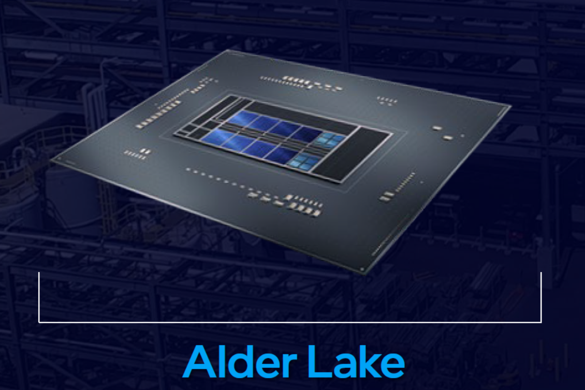

# Using Alder Lake

## OpenCore Alder Lake (12th-Gen Intel) Hackintosh Guidance



What can we learn from existing successful OpenCore Alder Lake desktop builds? I looked at almost every documented system on the major English and German hackintosh sites. In this article I will share the key points that I noticed when looking at these builds, documentation and configurations. This is just a very preliminary guide, since Dortania does not have an _OpenCore Alder Lake Guide_ yet.&#x20;

Essentially follow the [Desktop Comet Lake | OpenCore Install Guide](https://dortania.github.io/OpenCore-Install-Guide/config.plist/comet-lake.html) and incorporate the insights listed below. As always, do not just copy an EFI which you might find in other people's documentation. It may not work, is hard to maintain and is against the rules of [r/hackintosh](https://www.reddit.com/r/hackintosh/). Create your own EFI based on the guide.

### Actual Hardware used:

#### Motherboards

Mostly Z690 and a few B660M, but no Hackintosh seen yet with H610 or H670. Gigabyte and Asus have been used in the great majority of observed systems. macOS on Alder Lake laptops is not possible, due to the unsupported iGPU.

* Gigabyte Z690I AORUS ULTRA DDR4 - Mini-ITX
* Gigabyte Z690i Aorus Ultra DDR4 - Mini-ITX
* Gigabyte Z690 UD DDR4 - ATX
* Gigabyte Z690 Aorus Elite DDR5 - ATX
* Gigabyte Z690 Aorus Elite AX DDR4 - ATX
* Gigabyte Z690 Aorus Pro DDR5 - ATX
* Gigabyte Z690 AERO G DDR4 (plus Thunderbolt card) - ATX
* ASUS Z690 ProArt Creator WiFi (Thunderbolt 4) DDR5 - ATX
* ASUS ROG STRIX Z690-A GAMING WIFI D4 DDR4 - ATX
* ASUS ROG STRIX Z690-F GAMING WIFI DDR5 - ATX
* ASUS PRIME Z690M-PLUS D4 DDR4 - microATX
* ASUS PRIME Z690-P D4 LGA DDR4 - ATX
* ASUS TUF GAMING Z690-PLUS D4 DDR4 - ATX
* ASUS PRIME B660M-K D4 DDR4 - microATX
* ASRock Z690 Pro RS DDR4 - ATX
* ASRock Z690 Steel Legend WiFi 6E DDr4 - ATX
* ASRock B660M-HDV DDR4 - microATX
* MSI PRO Z690-A DD5 - ATX

#### CPUs actually used

* i5-12400, i5-12400F
* i5-12600K, i5 12600KF
* i7-12700K, i7-12700KF
* i9-12900K&#x20;

All currently available Alder Lake Core-i-x-12xxx CPUs should work.

#### GPUs actually used

* PowerColor Radeon RX 6600
* Sapphire VGA Nitro+ RX 6600 XT
* ASRock AMD Radeon RX 6600XT
* MSI RX 6800 XT Gaming X Trio
* Sapphire RX 6900 XT Special Edition
* Yeston Radeon RX560 4GB GDDR5
* AMD Radeon RX 570
* Sapphire RX 580

#### Recommended GPUs

Discrete GPUs are supported without any limitations including DRM and digital audio. _(Vit, 22-01-09)_

In the context of Alder Lake, I have seen primarily recommended: _Polaris_ AMD RX 400 series & RX 500 series, as well as _Navi_ RX 5000 series, RX 6800, RX 6800 XT, RX 6900 XT. AMD RX 6600 and 6600 XT are only supported in Monterey 12.1 and newer. (But the RX 6700 is currently not supported at all.)

The only two recommended SMBIOS on Alder Lake - `MacPro7,1` and `iMacPro1,1` - require a _Polaris, Vega or Navi GPU_ to work properly. Also refer to the Dortania recommendations in [GPU Support | OpenCore Install Guide](https://dortania.github.io/OpenCore-Install-Guide/macos-limits.html#gpu-support) and [GPU Buyers Guide](https://dortania.github.io/GPU-Buyers-Guide/).

#### SSDs actually used

* WD SN850 PCIe 4.0 NVMe SSD 1TB
* WD Black SN750 SE NVMe SSD 1TB
* WD Blue SN550 NVMe 1TB
* PNY CS1031 256GB&#x20;

Some Samsung NVMe drives may still have problems: [SSD boot time tests · dortania](https://github.com/dortania/bugtracker/issues/192).

#### Wifi Cards actually used

* Fenvi FV-T919 WiFi / Bluetooth Wireless Card
* Fenvi M.2 NGFF BCM94360NG Wifi / Bluetooth 4.0 Network Card&#x20;

The recommendations from the [Wireless Buyers Guide](https://dortania.github.io/Wireless-Buyers-Guide/) continue to apply.

#### OS used

* Monterey (mostly)
* Big Sur

macOS Catalina 10.15.4 and above should work based on Comet Lake support in macOS.

### Notes

* Thermal management works. While Intel Power Gadget is rather buggy and not recommended in production, it mostly works, so do SuperIO and SMCProcessor. _(Vit, 22-01-09)_

### Things that don't work

* Sidecar requires either an iGPU or an Apple T2 chip for HEVC encoding/decoding so it does not work on this system (iGPU UHD 770 is not supported by macOS). Alternatives to Sidecar: Luna Display and Duet Display.
* macOS treats all cores the same and does not schedule tasks optimally between P-cores and E-cores
* Intel's Bluetooth 5.2 is not yet supported.
* Various USB issues. These may not be specific to Alder Lake, but were reported on some motherboards.

### BIOS:

All the BIOS configurations are essentially the same as used for Comet Lake, except for the CPU configuration.

* CFG Lock may not be configurable in preferences on ASUS boards. This is an obvious BIOS bug, although it may not cause boot failures. We had to unlock it manually through the Shell method described in OpenCore Reference Manual. _(Vit, 22-01-09)_
* XMP works at least with DDR5 we had at hand, but there were reports of no issues with DDR4 as well. While macOS does not name DDR5 as DDR5 in the profiler, this nuance is purely cosmetic. _(Vit, 22-01-09)_

#### P-cores and E-cores

Experiment with either of these configurations to see which works best for your workflow:

* **Option 1:** All P-cores, all E-cores, and Hyper-Threading enabled. The Ring Clock frequency will be 3.6 GHz with a [CPU performance impact of no more than 6%](https://chipsandcheese.com/2021/12/16/alder-lake-e-cores-ring-clock-and-hybrid-teething-troubles/), due to lesser L3 and memory performance of the P-cores. Overall multi-threading performance will be better.
* **Option 2:**: Only P-cores and Hyper-Threading enabled. The Ring Clock frequency will be 4.7 GHz. Overall multi-threading performance will be less.
* Both options may be optimised by [Alder Lake Overclocking](https://skatterbencher.com/2021/11/04/alder-lake-overclocking-whats-new/#Disable\_Ring\_to\_Core\_Ratio\_Offset). The Ring Clock and CPU clock are separate.

Therefore in **BIOS > Advanced CPU Settings** configure accordingly:

* **Option 1**: _All cores, all threads_
  * Hyper Threading → Enabled
  * All P-Cores and E-Cores → Enabled
* **Option 2**: _Only P-cores and Hyper-Threads_
  * Hyper Threading → Enabled
  * CPU Cores Enabling Mode → Selectable Mode
  * CPU Cores Enabling Mode → (Enable all P-Cores and Disable all E-Cores)

### OpenCore Config.plist Configuration

Use the latest version of [OpenCore](https://github.com/acidanthera/OpenCorePkg/releases/), at least 0.7.7

#### ACPI -> Add

Required to add `SSDT-PLUG-ALT.aml` [XCPM power management compatibility table with Darwin method for Alder Lake CPUs](https://github.com/acidanthera/OpenCorePkg/blob/master/Docs/AcpiSamples/Source/SSDT-PLUG-ALT.dsl).

* Most firmware dropped _Processor_-based CPU definition in ACPI and switched to _Device_-based definition, which is not recognised by macOS. To workaround this one needs to use the `SSDT-PLUG-ALT` ACPI table. _(Vit, 22-01-09)_

#### SSDTs

Very similar to Comet Lake, except for the additional _SSDT-PLUG-ALT.aml_

* SSDT-PLUG-ALT.aml (required)
* SSDT-AWAC.aml (required)
* SSDT-EC-USBX.aml (required)
* SSDT-SBUS.aml (optional)
* SSDT-USBW.aml (optional) Works with USBWakeFixup.kext to enable proper wake from sleep.
* SSDT-DMAC.aml (occasionally used) As on a real MacPro 7,1 : "the DMAC Direct Memory Access Controller provides an interface between the bus and the input-output devices , share the bus with the processor to make the data transfer, speedups the memory operations by bypassing the involvement of the CPU ".
* SSDT-HPET.aml (occasionally used) - Patches out IRQ conflicts. Check:  [SSDTs: The easy way](https://dortania.github.io/Getting-Started-With-ACPI/ssdt-methods/ssdt-easy.html#running-ssdttime) (SSDTTime > HPET).
* SSDT-DTPG.aml (occasionally used) - Implements DTGP method that is needed by other SSDTs. Related to Thunderbolt.

#### ACPI -> Patch (optional)

I see many configurations with various ACPI patches. Other Alder Lake systems use none of these patches. Apply as needed:

```
TableSignature  OemTableId        TableLength  Find              Replace           Count  Comment 
44534454                          0            4D435F5F          4D434843          0      Change MC__ to MCHC
53534454        4967667853736474  0            4D435F5F          4D434843          0      Change MC__ to MCHC
53534454        475357417070      0            4303141941444247  4303141958444247  1      Change ADBG to XDBG
```

* Enable _Change MC\_\_ to MCHC_ and possibly _Change ADBG to XDBG_ as shown above, if you encounter relevant ACPI Errors:
  * See: [fix wake from sleep issue on _**Gigabyte** Z690_ boards](https://www.tonymacx86.com/threads/z690-chipset-and-alder-lake-cpus.316618/page-132#post-2291256).
  * _Change ADBG to XDBG_ is related to an [ACPI error](https://www.tonymacx86.com/threads/gigabyte-z690-aero-g-i5-12600k-amd-rx-6800-xt.317179/page-25#post-2291723) on **Gigabyte** Z690 boards.
  * _Change MC\_\_ to MCHC_ is also used on **ASUS** Z690 boards.
* _HPET \_CRS to XCRS Rename_, _RTC IRQ 8 Patch_, _TIMR IRQ 0 Patch._ Check:  [SSDTs: The easy way](https://dortania.github.io/Getting-Started-With-ACPI/ssdt-methods/ssdt-easy.html#running-ssdttime) (SSDTTime > HPET).
* _Fix RTC \_STA bug_ (seems to be an old fix previously used in Clover which should not be necessary in OpenCore). Try instead:  [SSDTs: The easy way](https://dortania.github.io/Getting-Started-With-ACPI/ssdt-methods/ssdt-easy.html#running-ssdttime) (SSDTTime > AWAC)

#### Booter -> Quirks

`ResizeAppleGpuBars -1` (or 0, if Re-Sizable BAR Support is enabled in BIOS)

* We did not have PCIe 5.0 hardware to ensure optimal performance, but there were no issues with PCIe 4.0 and 3.0 including Resize Bar support handled by the `ResizeAppleGpuBars` quirk. _(Vit, 22-01-09)_

#### Kexts in Kernel -> Add

The kexts used are essentially the same as the ones used for Comet Lake:

* Lilu.kext (required)
* WhateverGreen.kext (required)
* VirtualSMC.kext (required)
  * SMCProcessor.kext (optional - monitoring CPU temperature)
  * SMCSuperIO.kext (optional - monitoring fan speed)
* AppleALC.kext (usually required - enable audio)
* NVMeFix.kext (optional - for fixing power management and initialization on non-Apple NVMe)

**Other common kexts used on Alder Lake:**

* [RestrictEvents.kext](https://github.com/acidanthera/RestrictEvents) - Lilu Kernel extension for blocking unwanted processes causing compatibility issues on different hardware. - Is needed when enabling E-cores due to large core count and makes showing the proper CPU name possible.
* [CPUFriend.kext ](https://github.com/acidanthera/CPUFriend)- A Lilu plug-in for dynamic power management data injection. Used with CpuFriendDataProvider.kext which can be created according to the instructions here: [CPUFriend/Instructions](https://github.com/acidanthera/CPUFriend/blob/master/Instructions.md)
  * Partial XCPM (XNU CPU Power Management) compatibility is available, but frequency vector tuning (through CPUFriend) will be [required](https://github.com/dortania/bugtracker/issues/190). _(Vit, 22-01-09)_
* An Ethernet kext. Commonly found on Z690:
  * [LucyRTL8125Ethernet.kext](https://github.com/Mieze/LucyRTL8125Ethernet) - A macOS driver for Realtek RTL8125 2.5GBit Ethernet Controllers.
* [USBWakeFixup](https://github.com/osy/USBWakeFixup) is needed to fix keyboard wakeup support, but may cause [compatibility issues](https://github.com/osy/USBWakeFixup/issues/14) with Bluetooth. Works with SSDT-USBW.
* Kexts for USB mapping, depending on the use of [USBMap](https://github.com/corpnewt/USBMap) or [USBToolBox](https://github.com/USBToolBox/tool)

See [Kexts | OpenCore Install Guide](https://dortania.github.io/OpenCore-Install-Guide/ktext.html#kexts) for more details.

#### Kernel -> Emulate

This is required for Alder Lake. The configurations universally use these settings:

* Emulate a Comet Lake CPU (0x0A0655)
* As Alder Lake CPUs are not supported by macOS, the CPU ID has to be faked in the Config.plist
* CPU ID is set to 0x0A0655 that is found in Comet Lake CPUs such as [10900, 10850, 10700, and 10400](https://www.cpu-world.com/cgi-bin/CPUID.pl?MANUF=Intel\&FAMILY=\&MODEL=\&SIGNATURE=656981\&PART=\&ACTION=Filter).&#x20;

```
Cpuid1Data    55060A00000000000000000000000000`
Cpuid1Mask    FFFFFFFF000000000000000000000000`
MinKernel     19.0.0
```

#### Kernel -> Quirks

`ProvideCurrentCpuInfo Yes`

* More patches are required for XNU when using the efficiency cores, though handled automatically by the `ProvideCurrentCpuInfo` quirk starting with OpenCore 0.7.7. _(Vit, 22-01-09)_

#### NVRAM -> Add

**7C436110-AB2A-4BBB-A880-FE41995C9F82** The `boot-args` follow the same pattern as described in [OpenCore Install Guide - NVRAM](https://dortania.github.io/OpenCore-Install-Guide/config.plist/comet-lake.html#nvram). The only required additional argument is this:

* `-wegnoigpu` to disable internal GPU, which is not supported.
* A typical _boot-args_ may look like this: `-v keepsyms=1 debug=0x100 agdpmod=pikera -wegnoigpu alcid=1`
* `agdpmod=pikera` is used for disabling board ID checks on _Navi GPUs_ (RX 5000 & 6000 series), without this you'll get a black screen. Don't use if you don't have Navi (ie. Polaris and Vega cards shouldn't use this).
* In case the iGPU is needed for other operating systems, there are other ways to hide the iGPU described here: [Disabling GPU | OpenCore Install Guide](https://dortania.github.io/OpenCore-Install-Guide/extras/spoof.html#disabling-gpu).

**4D1FDA02-38C7-4A6A-9CC6-4BCCA8B30102**

* Optionally add your CPU name, for example:

```
revcpuname    String    10-Core Intel i5-12600K
revcpu        Number    1
```

* this is working together with the [acidanthera/RestrictEvents.kext](https://github.com/acidanthera/RestrictEvents/tree/64c9ea31fa62081f8fcc3076ca96d8d39d8c6ca2)

#### PlatformInfo -> Generic

Use one of

* `MacPro7,1`
* `iMacPro1,1`

I have seen `iMac20,1` used by some on Alder Lake, but this is the wrong choice, because the iGPU needs to be disabled, since Apple has not created any drivers for 12th Gen iGPUs. You must pay very close attention when selecting a SMBIOS, as macOS assumes the iGPU is present on every `iMac` SMBIOS. Features like Quick Look and such will be broken if macOS based on the the SMBIOS expects an iGPU.

`MacPro7,1` and `iMacPro1,1` are the only two SMBIOS that will allow for dGPU to handle all the workload including background rendering and other tasks that the iGPU would handle.

* You'll likely need to fix power management as sleep may break: [Fixing Power management](https://dortania.github.io/OpenCore-Post-Install/universal/pm.html).
* Note that this requires a _Polaris, Vega or Navi GPU_ to work properly.

`MacPro7,1` is used in the majority of Alder Lake systems and appears to be the recommended choice. Read this for details: [Choosing the right SMBIOS | OpenCore Install Guide](https://dortania.github.io/OpenCore-Install-Guide/extras/smbios-support.html#how-to-decide).

#### UEFI -> Output

`ProvideConsoleGop Yes`&#x20;

* ASUS boards have a new aggregate GOP instance, which causes black screen during macOS first stage. This is addressed in the `ProvideConsoleGop` quirk starting with OpenCore 0.7.6. _(Vit, 22-01-09)_
* This is enabled in OC > _Sample.plist_ and should remain enabled, not just for ASUS boards.

#### Thunderbolt related

Some of the configurations use Thunderbolt. Therefore these changes are only needed if the motherboard has Thunderbolt or an add-in card is used: **AppleVTD** allows certain Thunderbolt devices to connect and operate, such as Antelope Audio interfaces and Apple's own Thunderbolt-to-Gigabit Ethernet adapter. - Enabling AppleVTD requires the following:

1. Kernel --> Quirks --> DisableIoMapper --> **No** (affects macOS only)
2. ACPI --> Add --> SSDT-DMAR.aml --> **Yes** (affects all operating systems)
3. ACPI --> Delete --> DMAR --> **Yes** (affects all operating systems)
4. BIOS Setup --> VT-d --> **Enabled**

Also see here: [Fixing Sleep | OpenCore Post-Install](https://dortania.github.io/OpenCore-Post-Install/universal/sleep.html#fixing-thunderbolt)

### Successful BUILD LIST

I researched more in-depth about the specifics which might differ from a Comet Lake configuration by looking at many documented _successful projects_ reported on r/hackintosh, TM, Github, hackintosh-forum-de and InsanelyMac.

#### r/Hackintosh

* [ASRock Z690 Pro RS with i5 12600k](https://www.reddit.com/r/hackintosh/comments/rps44y/asrock\_z690\_pro\_rs\_with\_i5\_12600k/)
* [ASRock B660M-HDV + i5-12400 (RX570/GT710) (BigSur)](https://www.reddit.com/r/hackintosh/comments/sa6h01/asrock\_b660mhdv\_i512400\_rx570gt710\_bigsur/)
* [Success: Asrock B660M-HDV & i5-12400F](https://www.reddit.com/r/hackintosh/comments/sa87ax/success\_asrock\_b660mhdv\_i512400f/)

#### Golden and User Builds on TM

* Discussion: [Z690 Chipset and Alder Lake CPUs](https://www.tonymacx86.com/threads/z690-chipset-and-alder-lake-cpus.316618/)
* Golden Build: [Gigabyte Z690 Aero G + i5-12600K + AMD RX 6800 XT](https://www.tonymacx86.com/threads/gigabyte-z690-aero-g-i5-12600k-amd-rx-6800-xt.317179/)
* Golden Build: [Asus Z690 ProArt Creator WiFi (Thunderbolt 4) + i7-12700K + AMD RX 6800 XT](https://www.tonymacx86.com/threads/asus-z690-proart-creator-wifi-thunderbolt-4-i7-12700k-amd-rx-6800-xt.318311/)
* User Build: [ASRock Z690 Steel Legend (WiFi 6E)](https://www.tonymacx86.com/threads/asrock-z690-steel-legend-wifi-6e.317456/) nice guide including CPU ID explanation.
* User Build: [Gigabyte Z690 ELITE AX D4 + i9-12900K + AMD RX 6600 XT](https://www.tonymacx86.com/threads/gigabyte-z690-elite-ax-d4-i9-12900k-amd-rx-6600-xt.318584/)
* User Build: [ ](https://www.tonymacx86.com/threads/success-z690i-intel-12th-gen-cpu-i5-12400-low-cost.318759/)Gigabyte Z690I AORUS ULTRA [Intel 12th Gen CPU i5-12400 (low cost)](https://www.tonymacx86.com/threads/success-z690i-intel-12th-gen-cpu-i5-12400-low-cost.318759/) clean, minimal configuration.

The _Golden Builds_ are well documented and would help those who buy the same motherboard and CPU. - Yet, I am not satisfied just copying a configuration, since I might buy different hardware and I should be able to understand every part of the Config to maintain it longterm. Also you should use the tools recommended on r/hackintosh.

#### Github

* [glekner/GIGABYTE-Z690I-Hackintosh: OpenCore Hackintosh EFI For Gigabyte Z690I Aorus](https://github.com/glekner/GIGABYTE-Z690I-Hackintosh)
* [luchina-gabriel/EFI-GIGABYTE-Z690-AORUS-ELITE-AX-12900K-RX6900XT: EFI for Hackintosh: Gigabyte Z690 Aorus Elite AX, Intel i9 12900K (8p+8e+ht), RX 6900XT, 4x 16GB DDR4 4133Mhz with XMP enabled and Fenvi BCM94360](https://github.com/luchina-gabriel/EFI-GIGABYTE-Z690-AORUS-ELITE-AX-12900K-RX6900XT)
* [kenagt/Hackintosh-Gigabyte-Z690-UD-DDR4: EFI folder for hackintosh, Z690, 12600KF, 32GB DDR4](https://github.com/kenagt/Hackintosh-Gigabyte-Z690-UD-DDR4)
* [kreactnative/Z690-12900K-RX6600XT-DDR5-Monterey: Hackintosh EFI For 12900K Gigabyte Z690 Aorus Pro](https://github.com/kreactnative/Z690-12900K-RX6600XT-DDR5-Monterey)
* [H3C4T0M8/Hackintosh-Gigabyte-z690-UD-DDR4-OpenCore](https://github.com/H3C4T0M8/Hackintosh-Gigabyte-z690-UD-DDR4-OpenCore)
* [jiangyurui/ROG-STRIX-Z690-A-GAMING-WIFI-HACKINTOSH-BIOS](https://github.com/jiangyurui/ROG-STRIX-Z690-A-GAMING-WIFI-HACKINTOSH-BIOS)

### hackintosh-forum.de

* [Neuer Hackintosh mit ASUS PRIME Z690M-PLUS D4](https://www.hackintosh-forum.de/forum/thread/55711-neuer-hackintosh-mit-asus-prime-z690m-plus-d4/?pageNo=1)
* [Z690 UD DDR4 Alder Lake](https://www.hackintosh-forum.de/forum/thread/55598-z690-ud-ddr4-alder-lake/)

### InsanelyMac

* [Vanilla Hackintosh Alder Lake Z690 with i9-12900K and AMD Radeon RX 6600 - Full DSDT Patched](https://www.insanelymac.com/forum/topic/349837-vanilla-hackintosh-alder-lake-z690-with-i9-12900k-and-amd-radeon-rx-6600-full-dsdt-patched-opencore-or-clover-bootloader/) very limited usefulness of these DSDT based configurations, except to see the hardware used.

### Search Links

* To be able to see the various successes of Alder Lake  on _r/hackintosh_ enter the following in the search box for Z690: [`flair_name:"SUCCESS" Z690`](https://www.reddit.com/r/hackintosh/search/?q=flair\_name%3A%22SUCCESS%22%20Z690\&restrict\_sr=1\&sr\_nsfw=)``
  * Another example with B660M:  [`flair_name:"SUCCESS" B660M`](https://www.reddit.com/r/hackintosh/search/?q=flair\_name%3A%22SUCCESS%22%20B660M\&restrict\_sr=1\&sr\_nsfw=)``
* On TM search for: [Z690 User Builds ](https://www.tonymacx86.com/search/12515965/?q=Z690\&t=post\&c\[child\_nodes]=1\&c\[nodes]\[0]=28\&c\[title\_only]=1\&o=date)or [Z690 Golden Builds](https://www.tonymacx86.com/search/12516092/?q=Z690\&t=post\&c\[child\_nodes]=1\&c\[nodes]\[0]=87\&c\[title\_only]=1\&o=date)
* Or search for _Alder Lake_ for general info on each hackintosh site

## More Info

* Additional details have been discussed in this **essential technical article**: [Intel Z690 compatibility with macOS | Dortania](https://dortania.github.io/hackintosh/updates/2022/01/09/alder-lake.html)). _Vit, 2022-01-09_
* A kext for Alder Lake currently in development: an **experimental** Lilu plugin that optimizes Alder Lake's heterogeneous core configuration: [GitHub - b00t0x/CpuTopologyRebuild](https://github.com/b00t0x/CpuTopologyRebuild)
* This section should eventually contain Alder Lake related updates to the guide. Started February 10: [OpenCore-Install-Guide/config.plist at alderlake · alyxferrari/OpenCore-Install-Guide · GitHub](https://github.com/alyxferrari/OpenCore-Install-Guide/tree/alderlake/config.plist)
* Discussion and relevant links in the comments: [Request for an initial version of a Dortania OpenCore Guide for Alder Lake · Issue #257 · dortania/bugtracker · GitHub](https://github.com/dortania/bugtracker/issues/257)
